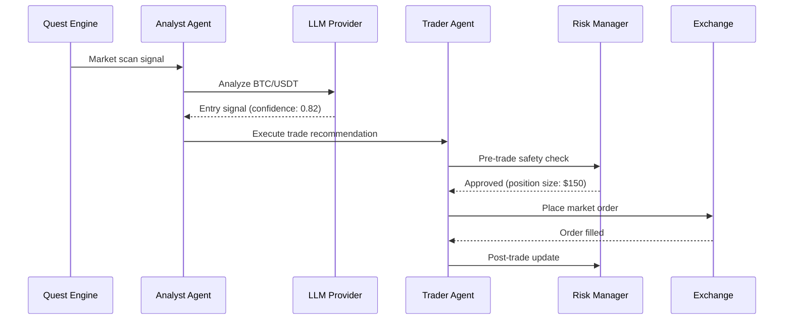

# AI Agents API

AI agents are autonomous entities that execute trading decisions using LLM-powered reasoning. NeuraTrade supports three primary agent roles:

## Agent Roles

### Analyst Agent

Analyzes market conditions and generates trading signals.

**Capabilities:**
- Technical indicator analysis
- Market regime detection
- Correlation analysis
- Sentiment aggregation
- Forecast generation

**Configuration:**
```typescript
{
  role: "analyst",
  provider: "zhipu",
  model: "glm-4-flash",
  context_window: 128000,
  skills: ["technical_analysis", "sentiment_analysis"]
}
```

### Trader Agent

Executes trades based on signals and market conditions.

**Capabilities:**
- Order execution planning
- Position sizing
- Entry/exit timing
- Slippage management
- Multi-exchange routing

**Configuration:**
```typescript
{
  role: "trader",
  provider: "minimax",
  model: "abab6.5s-chat",
  max_position_size: "500.00",
  max_concurrent_positions: 3,
  leverage: 5
}
```

### Risk Manager Agent

Monitors portfolio safety and enforces risk limits.

**Capabilities:**
- Real-time drawdown monitoring
- Position size throttling
- Daily/monthly loss tracking
- Emergency liquidation
- Safety gate enforcement

**Configuration:**
```typescript
{
  role: "risk_manager",
  max_daily_loss: "2.00%",
  max_drawdown: "5.00%",
  position_throttle: "100%",
  consecutive_loss_halt: 3
}
```

---

## Get AI Status

<RequestExample>
```bash
curl -X GET "https://api.neuratrade.ai/api/v1/telegram/internal/ai/status/123456789" \
  -H "X-Admin-API-Key: YOUR_ADMIN_KEY"
```
</RequestExample>

<ResponseExample>
```json
{
  "chat_id": "123456789",
  "enabled": true,
  "provider": "zhipu",
  "model": "glm-4-flash",
  "failover_chain": ["zhipu", "minimax"],
  "agents": [
    {
      "role": "analyst",
      "status": "active",
      "last_action": "2026-03-03T10:28:45Z"
    },
    {
      "role": "trader",
      "status": "active",
      "last_action": "2026-03-03T10:29:12Z"
    },
    {
      "role": "risk_manager",
      "status": "active",
      "last_action": "2026-03-03T10:30:00Z"
    }
  ],
  "usage": {
    "requests_today": 142,
    "tokens_today": 45230,
    "cost_today": "0.23"
  }
}
```
</ResponseExample>

Retrieves AI agent status and usage metrics for a chat.

### Path Parameters

<ParamField path="chatId" type="string" required>
  Telegram chat ID
</ParamField>

### Response Fields

<ResponseField name="enabled" type="boolean">
  Whether AI agents are enabled for this chat
</ResponseField>

<ResponseField name="provider" type="string">
  Primary LLM provider: `zhipu`, `minimax`, `anthropic`, `mlx`
</ResponseField>

<ResponseField name="model" type="string">
  Currently active model name
</ResponseField>

<ResponseField name="failover_chain" type="array">
  Ordered list of provider fallbacks
</ResponseField>

<ResponseField name="agents" type="array">
  Active agent instances
  
  <Expandable title="Agent Object">
    <ResponseField name="role" type="string">
      Agent role: `analyst`, `trader`, `risk_manager`
    </ResponseField>
    
    <ResponseField name="status" type="string">
      Agent status: `active`, `idle`, `error`
    </ResponseField>
    
    <ResponseField name="last_action" type="string">
      ISO 8601 timestamp of last action
    </ResponseField>
  </Expandable>
</ResponseField>

<ResponseField name="usage" type="object">
  Usage metrics
  
  <Expandable title="Usage Fields">
    <ResponseField name="requests_today" type="integer">
      API requests made today
    </ResponseField>
    
    <ResponseField name="tokens_today" type="integer">
      Total tokens consumed today
    </ResponseField>
    
    <ResponseField name="cost_today" type="string">
      Estimated cost in USD
    </ResponseField>
  </Expandable>
</ResponseField>

---

## Agent Configuration

Agents are configured via environment variables and operator settings:

### Environment Variables

```bash
# Primary AI Provider
NEURATRADE_AI_PROVIDER="zhipu"
ZHIPU_API_KEY="your_api_key_here"

# Failover Chain
NEURATRADE_AI_PROVIDER_CHAIN="zhipu,minimax"
MINIMAX_API_KEY="your_minimax_key"

# Timeouts and Retries
NEURATRADE_AI_HTTP_TIMEOUT_SECONDS=300
NEURATRADE_AI_MAX_RETRIES=5
NEURATRADE_AI_FAILOVER_MAX_HOPS=1

# Model Overrides
NEURATRADE_AI_PROVIDER_ZHIPU_MODEL="glm-4-flash"
NEURATRADE_AI_PROVIDER_MINIMAX_MODEL="abab6.5s-chat"
```

### Supported Providers

| Provider | Models | Context | Speed |
|----------|--------|---------|-------|
| **Zhipu** | glm-4-flash, glm-4-plus | 128K | Fast |
| **MiniMax** | abab6.5s-chat, abab6.5g-chat | 245K | Medium |
| **Anthropic** | claude-3.5-sonnet | 200K | Fast |
| **MLX** | Local models | Varies | Fast |

---

## Agent Execution Flow



<Info>
  Agents operate within [quest execution cycles](/api/autonomous/quests). Each quest invokes the appropriate agent based on task type.
</Info>

---

## Agent Coordination

Agents coordinate through the integrated quest handler system:

### Scalping Flow

1. **Market Scanner Quest** (every 1-5 min)
   - Analyst agent evaluates opportunities
   - Returns top-ranked symbols

2. **Scalping Execution Quest** (on signal)
   - Trader agent plans entry
   - Risk manager validates position size
   - Trade executed if approved

3. **Stop-Loss Monitor** (continuous)
   - Risk manager tracks open positions
   - Auto-liquidates if stop-loss hit

### Arbitrage Flow

1. **Funding Rate Scanner** (every 5 min)
   - Analyst detects funding rate anomalies
   
2. **Arbitrage Calculator**
   - Trader computes optimal position sizes
   - Risk manager validates capital allocation

3. **Execution**
   - Simultaneous spot + futures orders
   - Position tracked until funding settlement

<Warning>
  All agent actions are subject to **portfolio safety gates**. If drawdown exceeds limits or daily loss cap is hit, agents will halt trading until safety conditions are restored.
</Warning>

---

## Agent State Persistence

Agent decisions and outcomes are persisted in:

- **Trade Memory** (`ai_trade_memory` table)
  - Entry/exit reasoning
  - Outcome labels (win/loss)
  - Pattern recognition for learning

- **Lifecycle Store** (`trading_lifecycle_*` tables)
  - Order placement history
  - Position tracking
  - Realized PnL

- **Quest Checkpoints**
  - In-progress state
  - Retry attempts
  - Error recovery data