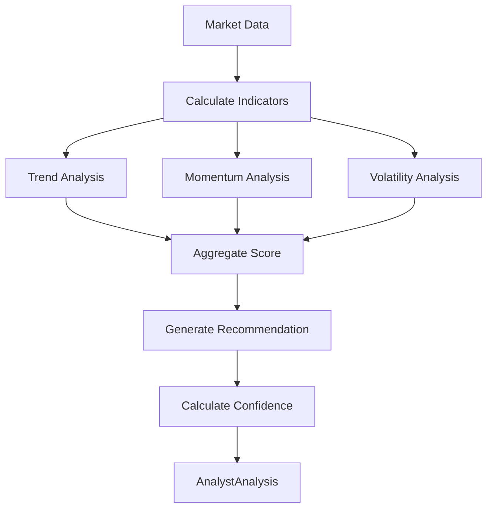
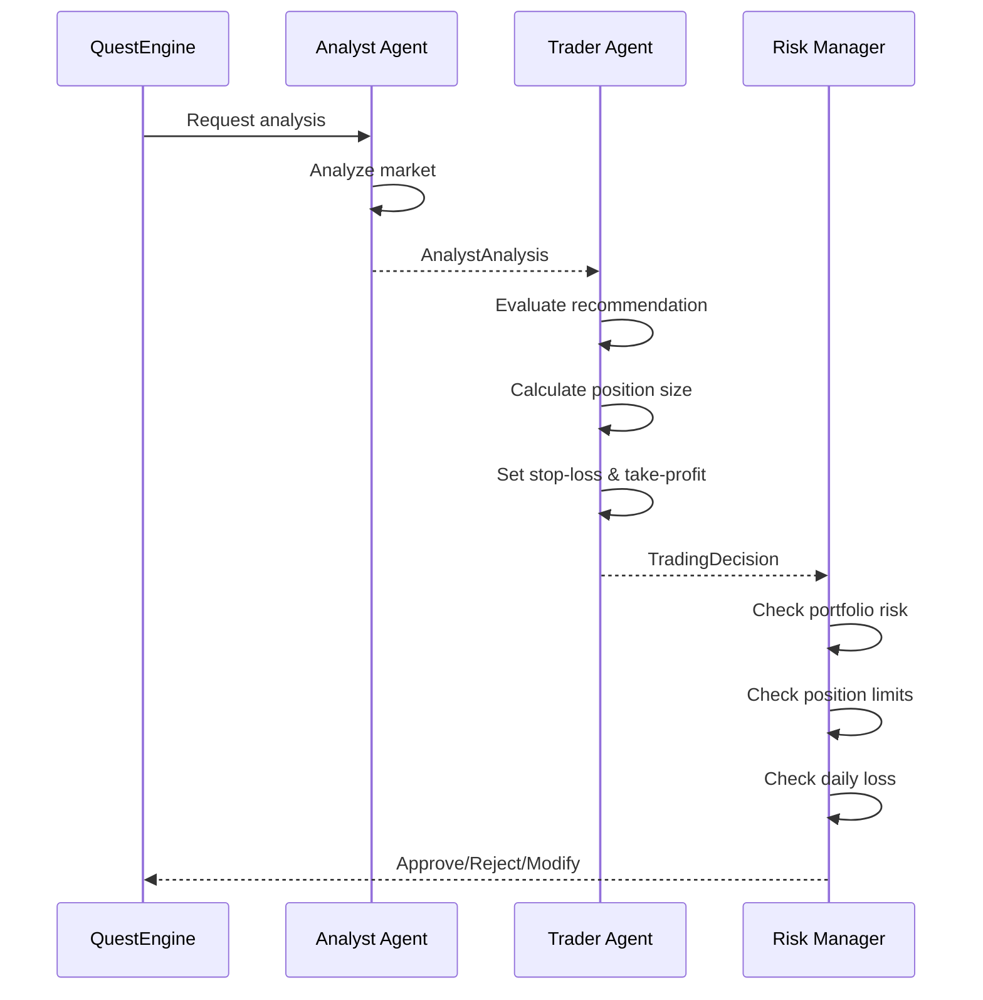
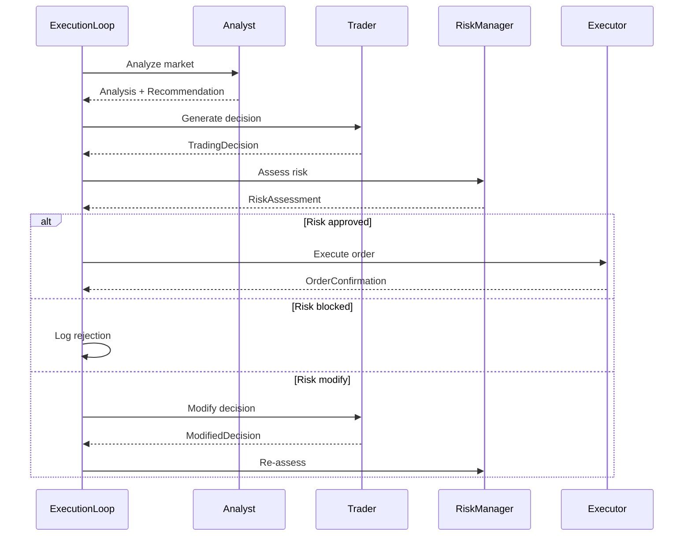
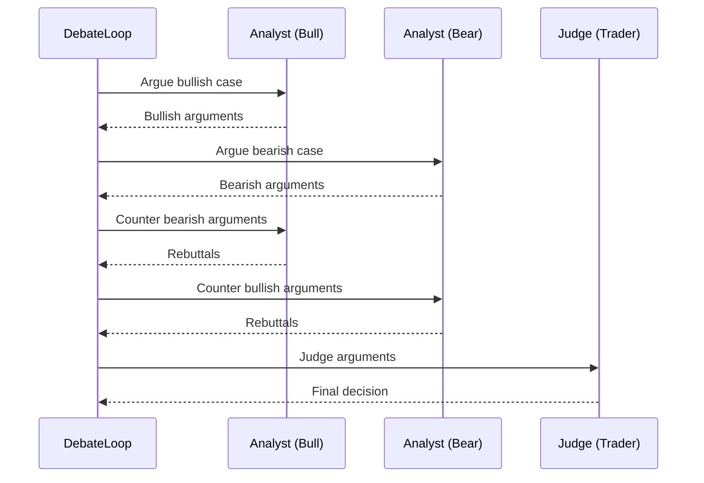

NeuraTrade's AI system uses a **multi-agent architecture** where specialized agents collaborate to make autonomous trading decisions. Each agent has a distinct role and expertise domain.

## Agent Roles

<CardGroup cols={3}>
  <Card title="Analyst Agent" icon="magnifying-glass-chart">
    **Market Analysis**
    
    Technical analysis, sentiment detection, market regime identification, signal generation
  </Card>
  <Card title="Trader Agent" icon="chart-line">
    **Trading Decisions**
    
    Position sizing, entry/exit planning, stop-loss/take-profit placement, execution timing
  </Card>
  <Card title="Risk Manager" icon="shield-halved">
    **Risk Assessment**
    
    Portfolio risk, position risk, daily loss tracking, emergency halt decisions
  </Card>
</CardGroup>

---

## Analyst Agent

The **Analyst Agent** provides market analysis and trading recommendations.

### Analyst Roles

```go
// services/backend-api/internal/services/analyst_agent.go:10-17
type AnalystRole string

const (
    AnalystRoleTechnical   AnalystRole = "technical"    // Chart patterns, indicators
    AnalystRoleSentiment   AnalystRole = "sentiment"    // News, social sentiment
    AnalystRoleOnChain     AnalystRole = "onchain"      // Blockchain metrics
    AnalystRoleFundamental AnalystRole = "fundamental"  // Project fundamentals
)
```

### Analysis Output

```go
type AnalystAnalysis struct {
    Symbol         string                  // e.g., "BTC/USDT"
    Role           AnalystRole             // technical, sentiment, etc.
    Condition      MarketCondition         // bullish, bearish, neutral, volatile
    Recommendation AnalystRecommendation   // buy, sell, hold, watch, avoid
    Confidence     float64                 // 0.0 - 1.0
    Score          float64                 // Weighted score
    Signals        []AnalystSignal         // Individual signals
    Summary        string                  // Natural language summary
    RiskLevel      string                  // low, medium, high, extreme
}
```

### Technical Analysis Flow



### Analyst Signals

```go
type AnalystSignal struct {
    Name        string           // e.g., "RSI Oversold"
    Value       float64          // Signal value
    Weight      float64          // Importance weight
    Direction   SignalDirection  // bullish, bearish, neutral
    Description string           // Human-readable explanation
}
```

**Example Signals**:

<AccordionGroup>
  <Accordion title="Trend Signals">
    - **EMA Crossover**: 9-period crosses 21-period
    - **MACD Signal**: MACD line crosses signal line
    - **ADX Strength**: Trend strength above 25
  </Accordion>
  
  <Accordion title="Momentum Signals">
    - **RSI Overbought/Oversold**: RSI > 70 or < 30
    - **Stochastic**: %K crosses %D
    - **CCI Extreme**: CCI > 100 or < -100
  </Accordion>
  
  <Accordion title="Volatility Signals">
    - **Bollinger Squeeze**: Price touching bands
    - **ATR Expansion**: Volatility increasing
    - **Keltner Breakout**: Price outside channels
  </Accordion>
</AccordionGroup>

### Analyst Metrics

```go
type AnalystAgentMetrics struct {
    TotalAnalyses    int64            // Total analyses performed
    BuySignals       int64            // Buy recommendations
    SellSignals      int64            // Sell recommendations
    HoldSignals      int64            // Hold recommendations
    AvgConfidence    float64          // Average confidence score
    AnalysesBySymbol map[string]int64 // Per-symbol analysis count
    AnalysesByRole   map[string]int64 // Per-role analysis count
}
```

<Info>
Analyst implementation: `services/backend-api/internal/services/analyst_agent.go:48-150`
</Info>

---

## Trader Agent

The **Trader Agent** converts analysis into concrete trading decisions.

### Trading Decision

```go
// services/backend-api/internal/services/trader_agent.go:66-81
type TradingDecision struct {
    ID             string
    Symbol         string
    Action         TradingAction     // open_long, open_short, close_long, etc.
    Side           PositionSide      // long, short, flat
    SizePercent    float64           // Position size as % of portfolio
    EntryPrice     float64
    StopLoss       float64
    TakeProfit     float64
    Confidence     float64           // Decision confidence
    Reasoning      string            // Natural language explanation
    RiskScore      float64           // Risk assessment
    ExpectedReturn float64           // Expected profit
}
```

### Trading Actions

```go
type TradingAction string

const (
    ActionOpenLong   TradingAction = "open_long"    // Enter long position
    ActionOpenShort  TradingAction = "open_short"   // Enter short position
    ActionCloseLong  TradingAction = "close_long"   // Exit long position
    ActionCloseShort TradingAction = "close_short"  // Exit short position
    ActionAddToPos   TradingAction = "add_to_position"   // Increase position
    ActionReducePos  TradingAction = "reduce_position"  // Decrease position
    ActionHold       TradingAction = "hold"          // No action
    ActionWait       TradingAction = "wait"          // Wait for better entry
)
```

### Decision Flow



### Position Sizing

Trader uses **Kelly Criterion** for position sizing:

```go
// Simplified Kelly Criterion
winRate := historicalWinRate
avgWin := averageWinAmount
avgLoss := averageLossAmount

kellyPercent := (winRate * avgWin - (1 - winRate) * avgLoss) / avgWin

// Apply safety factor (typically 0.25-0.5)
safetyFactor := 0.5
positionSize := kellyPercent * safetyFactor

// Cap at max position size
if positionSize > config.MaxPositionSize {
    positionSize = config.MaxPositionSize
}
```

### Stop-Loss & Take-Profit

```go
// ATR-based stop-loss
atr := calculateATR(symbol, 14)
stopLoss := entryPrice - (atr * config.StopLossMultiplier)

// Risk-reward based take-profit
riskAmount := entryPrice - stopLoss
takeProfit := entryPrice + (riskAmount * config.RiskRewardRatio)
```

### Trader Metrics

```go
type TraderAgentMetrics struct {
    TotalDecisions    int64            // Total decisions made
    TradesExecuted    int64            // Trades actually executed
    TradesSkipped     int64            // Trades skipped (low confidence, etc.)
    Wins              int64            // Winning trades
    Losses            int64            // Losing trades
    TotalPnL          float64          // Total profit/loss
    AvgConfidence     float64          // Average decision confidence
    DecisionsByAction map[string]int64 // Per-action decision count
}
```

<Info>
Trader implementation: `services/backend-api/internal/services/trader_agent.go:109-150`
</Info>

---

## Risk Manager Agent

The **Risk Manager** is the final gatekeeper before order execution.

### Risk Assessment

```go
// services/backend-api/internal/services/risk/risk_manager_agent.go:45-61
type RiskAssessment struct {
    ID              string
    Role            RiskManagerRole   // portfolio, position, trading, emergency
    Symbol          string
    Action          RiskAction        // approve, warning, block, reduce, close
    RiskLevel       RiskLevel         // low, medium, high, extreme
    Confidence      float64
    Score           float64           // Risk score (0-1)
    Reasons         []string          // Why approved/rejected
    Recommendations []string          // Suggested modifications
    MaxPositionSize decimal.Decimal   // Adjusted position size
    StopLossPct     float64           // Suggested stop-loss %
    TakeProfitPct   float64           // Suggested take-profit %
}
```

### Risk Actions

```go
type RiskAction string

const (
    RiskActionApprove   RiskAction = "approve"    // Allow trade as-is
    RiskActionWarning   RiskAction = "warning"    // Allow with warning
    RiskActionBlock     RiskAction = "block"      // Reject trade
    RiskActionReduce    RiskAction = "reduce"     // Reduce position size
    RiskActionClose     RiskAction = "close"      // Close existing positions
    RiskActionEmergency RiskAction = "emergency"  // Emergency halt
)
```

### Risk Checks

<Steps>
  <Step title="Portfolio Risk Check">
    Verify total portfolio exposure:
    
    ```go
    totalRisk := calculatePortfolioRisk()
    if totalRisk > config.MaxPortfolioRisk {
        return RiskAssessment{
            Action:  RiskActionBlock,
            Reasons: []string{"Portfolio risk limit exceeded"},
        }
    }
    ```
  </Step>
  
  <Step title="Position Risk Check">
    Verify individual position risk:
    
    ```go
    positionRisk := (entryPrice - stopLoss) / entryPrice * positionSize
    if positionRisk > config.MaxPositionRisk {
        return RiskAssessment{
            Action:  RiskActionReduce,
            Reasons: []string{"Position risk too high"},
            MaxPositionSize: calculateSafePositionSize(),
        }
    }
    ```
  </Step>
  
  <Step title="Daily Loss Check">
    Verify daily loss limit:
    
    ```go
    dailyLoss := getDailyRealizedLoss()
    if dailyLoss.GreaterThan(config.MaxDailyLoss) {
        return RiskAssessment{
            Action:  RiskActionBlock,
            Reasons: []string{"Daily loss limit reached"},
        }
    }
    ```
  </Step>
  
  <Step title="Drawdown Check">
    Verify maximum drawdown:
    
    ```go
    currentDrawdown := calculateDrawdown()
    if currentDrawdown > config.MaxDrawdown {
        return RiskAssessment{
            Action:  RiskActionEmergency,
            Reasons: []string{"Max drawdown exceeded"},
        }
    }
    ```
  </Step>
  
  <Step title="Consecutive Loss Check">
    Verify consecutive loss limit:
    
    ```go
    consecutiveLosses := getConsecutiveLosses()
    if consecutiveLosses >= config.ConsecutiveLossLimit {
        return RiskAssessment{
            Action:  RiskActionBlock,
            Reasons: []string{"Consecutive loss limit reached"},
        }
    }
    ```
  </Step>
</Steps>

### Risk Configuration

```go
type RiskManagerConfig struct {
    MaxPortfolioRisk     float64         // 0.1 = 10% max portfolio at risk
    MaxPositionRisk      float64         // 0.02 = 2% max per position
    MaxDailyLoss         decimal.Decimal // $100 max daily loss
    MaxDrawdown          float64         // 0.15 = 15% max drawdown
    MinRiskRewardRatio   float64         // 2.0 = 1:2 min risk:reward
    MaxConcurrentTrades  int             // 5 max open positions
    EmergencyThreshold   float64         // 0.20 = 20% drawdown triggers emergency
    ConsecutiveLossLimit int             // 3 consecutive losses pause trading
}
```

<Warning>
**Emergency Halt**: When `EmergencyThreshold` is exceeded, Risk Manager triggers emergency halt and closes all positions.
</Warning>

---

## Execution Loop

The **Agent Execution Loop** coordinates multi-agent interaction.

### Loop Configuration

```go
// services/backend-api/internal/services/agent_execution_loop.go:38-52
type AgentExecutionLoopConfig struct {
    MaxIterations       int           // Max LLM iterations per cycle
    Timeout             time.Duration // Max time per cycle
    RequireRiskApproval bool          // Require Risk Manager approval
    MinConfidence       float64       // Min confidence to execute
    EnableToolCalls     bool          // Enable LLM tool calling
    AutoExecute         bool          // Auto-execute approved orders
}
```

### Execution Flow



### Tool Calls

Agents can invoke tools for real-time data:

```go
type ToolExecutor interface {
    Execute(ctx context.Context, name string, args json.RawMessage) (json.RawMessage, error)
}

// Available tools
var tools = []Tool{
    {Name: "get_balance", Description: "Fetch account balance"},
    {Name: "get_positions", Description: "Fetch open positions"},
    {Name: "get_orderbook", Description: "Fetch order book depth"},
    {Name: "calculate_indicator", Description: "Calculate technical indicator"},
}
```

<Info>
Execution loop implementation: `services/backend-api/internal/services/agent_execution_loop.go:65-150`
</Info>

---

## Debate Loop

The **Agent Debate Loop** enables agents to challenge each other's recommendations.

### Debate Flow



<Tip>
Debate loop is used for **high-confidence decisions** where multiple perspectives improve decision quality.
</Tip>

---

## Agent Metrics

### Performance Tracking

```go
type ExecutionLoopMetrics struct {
    TotalCycles          int64            // Total execution cycles
    ApprovedExecutions   int64            // Approved by risk manager
    RejectedExecutions   int64            // Rejected by risk manager
    DeferredExecutions   int64            // Deferred for more analysis
    EmergencyTriggers    int64            // Emergency halts triggered
    TotalToolCalls       int64            // Tools invoked
    FailedToolCalls      int64            // Tool failures
    AverageIterations    float64          // Avg LLM iterations
    AverageExecutionTime float64          // Avg cycle time (ms)
    AverageConfidence    float64          // Avg decision confidence
    DecisionsBySymbol    map[string]int64
    DecisionsByAction    map[string]int64
}
```

### Metrics Endpoint

```bash
curl http://localhost:8080/api/agents/metrics
```

Returns:
```json
{
  "analyst": {
    "total_analyses": 1250,
    "buy_signals": 320,
    "sell_signals": 180,
    "avg_confidence": 0.73
  },
  "trader": {
    "total_decisions": 850,
    "trades_executed": 420,
    "win_rate": 0.62,
    "avg_pnl": 45.50
  },
  "risk_manager": {
    "total_assessments": 850,
    "approved": 420,
    "blocked": 380,
    "warnings": 50
  }
}
```

---

## Next Steps

<CardGroup cols={2}>
  <Card title="AI Skills" icon="book" href="/architecture/ai/skills">
    Skill system for prompt building
  </Card>
  <Card title="AI Reasoning" icon="lightbulb" href="/architecture/ai/reasoning">
    LLM provider registry and failover
  </Card>
</CardGroup>
