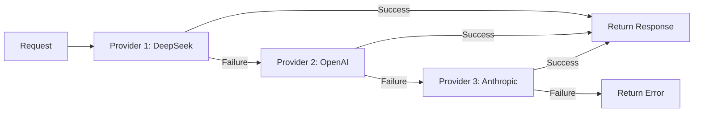
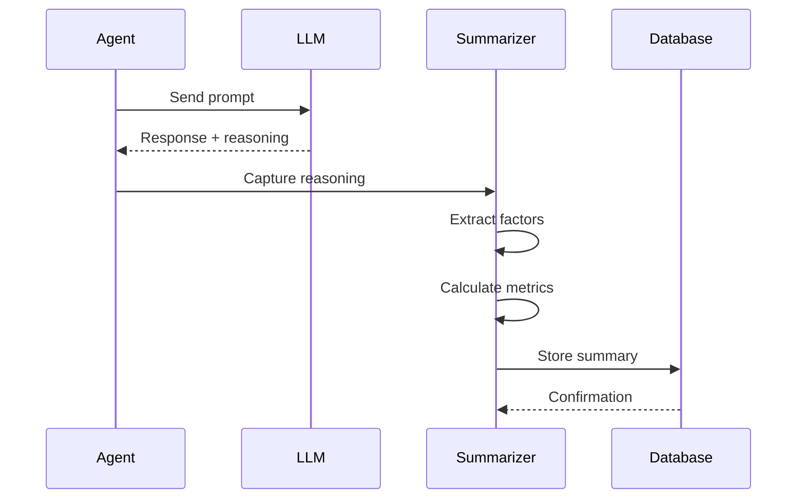

The **AI Reasoning System** manages LLM provider access, implements failover chains for reliability, and captures reasoning traces for transparency and debugging.

## LLM Provider Registry

NeuraTrade integrates with the **models.dev** API for unified model metadata and provider management.

### Registry Architecture

```go
// services/backend-api/internal/ai/registry.go:95-105
type Registry struct {
    client       *http.Client
    redis        *redis.Client
    logger       *zap.Logger
    modelsDevURL string  // https://models.dev/api.json
    cacheTTL     time.Duration
    localCache   *ModelRegistry
}
```

### Model Information

```go
type ModelInfo struct {
    ProviderID       string          // "openai", "anthropic", "deepseek"
    ProviderLabel    string          // "OpenAI", "Anthropic", "DeepSeek"
    ModelID          string          // "gpt-4o", "claude-3.5-sonnet"
    DisplayName      string          // Human-readable name
    Capabilities     ModelCapability // Supports tools, vision, reasoning
    Cost             ModelCost       // Token costs
    Limits           ModelLimits     // Context, input, output limits
    Tier             string          // "premium", "standard", "budget"
    LatencyClass     string          // "low", "medium", "high"
    Status           string          // "available", "deprecated"
}
```

<Info>
Registry implementation: `services/backend-api/internal/ai/registry.go:54-150`
</Info>

---

## Model Capabilities

The registry tracks model capabilities:

```go
type ModelCapability struct {
    SupportsTools     bool  // Can use function/tool calling
    SupportsVision    bool  // Can process images
    SupportsReasoning bool  // Has extended reasoning (e.g., o1, o3)
}
```

### Capability-Based Routing

```go
func (r *Registry) FindModelByCapability(cap ModelCapability) (*ModelInfo, error) {
    models := r.GetAllModels()
    
    for _, model := range models {
        if cap.SupportsTools && !model.Capabilities.SupportsTools {
            continue
        }
        if cap.SupportsVision && !model.Capabilities.SupportsVision {
            continue
        }
        if cap.SupportsReasoning && !model.Capabilities.SupportsReasoning {
            continue
        }
        
        return model, nil
    }
    
    return nil, ErrNoMatchingModel
}
```

**Example**: Analyst Agent requires tool calling:

```go
model, err := registry.FindModelByCapability(ModelCapability{
    SupportsTools: true,
})
// Returns: gpt-4o, claude-3.5-sonnet, etc.
```

---

## Cost Tracking

```go
type ModelCost struct {
    InputCost       decimal.Decimal  // Per 1M input tokens
    OutputCost      decimal.Decimal  // Per 1M output tokens
    ReasoningCost   decimal.Decimal  // Per 1M reasoning tokens (o1/o3)
    CacheReadCost   decimal.Decimal  // Cached prompt read cost
    CacheWriteCost  decimal.Decimal  // Cached prompt write cost
}
```

### Cost Calculation

```go
func calculateCost(model *ModelInfo, usage TokenUsage) decimal.Decimal {
    inputCost := model.Cost.InputCost.Mul(
        decimal.NewFromInt(usage.InputTokens),
    ).Div(decimal.NewFromInt(1_000_000))
    
    outputCost := model.Cost.OutputCost.Mul(
        decimal.NewFromInt(usage.OutputTokens),
    ).Div(decimal.NewFromInt(1_000_000))
    
    reasoningCost := decimal.Zero
    if usage.ReasoningTokens > 0 {
        reasoningCost = model.Cost.ReasoningCost.Mul(
            decimal.NewFromInt(usage.ReasoningTokens),
        ).Div(decimal.NewFromInt(1_000_000))
    }
    
    return inputCost.Add(outputCost).Add(reasoningCost)
}
```

**Example Cost Tracking**:

```go
type AIReasoningCost struct {
    ModelUsed      string
    InputTokens    int
    OutputTokens   int
    ReasoningTokens int
    TotalCost      decimal.Decimal
}
```

---

## Failover Chains

Failover chains provide **reliability through redundancy**.

### Chain Configuration

```go
type FailoverChain struct {
    Name      string
    Providers []ProviderConfig
    Strategy  FailoverStrategy  // "sequential", "cost-optimized", "latency-optimized"
}

type ProviderConfig struct {
    ProviderID string
    ModelID    string
    MaxRetries int
    Timeout    time.Duration
}
```

### Sequential Failover

Try providers in order until success:



```go
func (fc *FailoverChain) Execute(ctx context.Context, req Request) (*Response, error) {
    var lastErr error
    
    for _, provider := range fc.Providers {
        resp, err := provider.Call(ctx, req)
        if err == nil {
            return resp, nil
        }
        
        lastErr = err
        fc.logger.Warn("Provider failed, trying next",
            "provider", provider.ProviderID,
            "error", err)
    }
    
    return nil, fmt.Errorf("all providers failed: %w", lastErr)
}
```

### Cost-Optimized Failover

Try cheapest provider first:

```go
func (fc *FailoverChain) CostOptimizedOrder() []ProviderConfig {
    sorted := make([]ProviderConfig, len(fc.Providers))
    copy(sorted, fc.Providers)
    
    sort.Slice(sorted, func(i, j int) bool {
        costI := fc.getProviderCost(sorted[i])
        costJ := fc.getProviderCost(sorted[j])
        return costI.LessThan(costJ)
    })
    
    return sorted
}
```

**Example Chain**:

```go
chain := &FailoverChain{
    Name: "analyst-agent",
    Strategy: "cost-optimized",
    Providers: []ProviderConfig{
        {ProviderID: "deepseek", ModelID: "deepseek-chat"},      // Cheapest
        {ProviderID: "openai", ModelID: "gpt-4o-mini"},          // Mid-tier
        {ProviderID: "anthropic", ModelID: "claude-3.5-sonnet"}, // Premium
    },
}
```

### Latency-Optimized Failover

Try fastest provider first:

```go
func (fc *FailoverChain) LatencyOptimizedOrder() []ProviderConfig {
    sorted := make([]ProviderConfig, len(fc.Providers))
    copy(sorted, fc.Providers)
    
    sort.Slice(sorted, func(i, j int) bool {
        latencyI := fc.getProviderLatency(sorted[i])
        latencyJ := fc.getProviderLatency(sorted[j])
        return latencyI < latencyJ
    })
    
    return sorted
}
```

<Tip>
Use **cost-optimized** for routine analysis and **latency-optimized** for time-sensitive arbitrage decisions.
</Tip>

---

## Retry Logic

Automatic retries with exponential backoff:

```go
// services/backend-api/internal/ai/llm/retry.go
func (c *Client) CallWithRetry(ctx context.Context, req Request) (*Response, error) {
    maxRetries := 3
    backoff := time.Second
    
    for attempt := 0; attempt < maxRetries; attempt++ {
        resp, err := c.Call(ctx, req)
        if err == nil {
            return resp, nil
        }
        
        // Check if retryable
        if !isRetryable(err) {
            return nil, err
        }
        
        // Exponential backoff
        if attempt < maxRetries-1 {
            time.Sleep(backoff)
            backoff *= 2
        }
    }
    
    return nil, fmt.Errorf("max retries exceeded")
}

func isRetryable(err error) bool {
    // Retry on transient errors
    return errors.Is(err, ErrRateLimited) ||
           errors.Is(err, ErrTimeout) ||
           errors.Is(err, ErrServiceUnavailable)
}
```

---

## Reasoning Summarization

AI reasoning traces are captured and stored for transparency.

### Reasoning Summary

```go
// services/backend-api/internal/services/ai_reasoning_summarizer.go:24-42
type AIReasoningSummary struct {
    ID            string              // Unique summary ID
    UserID        string              // Operator user ID
    QuestID       *int64              // Associated quest
    TradeID       *int64              // Associated trade
    SessionID     string              // Execution session
    Category      AIReasoningCategory // signal_generation, risk_assessment, etc.
    Decision      string              // Final decision made
    Reasoning     string              // Explanation
    Confidence    decimal.Decimal     // Confidence score
    Factors       []string            // Contributing factors
    MarketContext string              // Market conditions
    RiskLevel     string              // Risk assessment
    ModelUsed     string              // LLM model used
    TokensUsed    int                 // Total tokens consumed
    LatencyMs     int                 // Response latency
    CreatedAt     time.Time
}
```

### Categories

```go
type AIReasoningCategory string

const (
    AICategorySignalGeneration  AIReasoningCategory = "signal_generation"
    AICategoryRiskAssessment    AIReasoningCategory = "risk_assessment"
    AICategoryTradeExecution    AIReasoningCategory = "trade_execution"
    AICategoryPortfolioDecision AIReasoningCategory = "portfolio_decision"
    AICategoryMarketAnalysis    AIReasoningCategory = "market_analysis"
)
```

### Capture Flow



### Storage

```go
func (s *AIReasoningService) GenerateSignalSummary(
    ctx context.Context,
    req *AIReasoningRequest,
) (*AIReasoningSummary, error) {
    summary := &AIReasoningSummary{
        ID:            fmt.Sprintf("reason-%s", uuid.New()),
        UserID:        req.UserID,
        Category:      req.Category,
        Decision:      req.Decision,
        Reasoning:     req.Reasoning,
        Confidence:    req.Confidence,
        Factors:       extractFactors(req.Reasoning),
        MarketContext: req.MarketContext,
        ModelUsed:     req.ModelUsed,
        TokensUsed:    req.TokensUsed,
        LatencyMs:     req.LatencyMs,
        CreatedAt:     time.Now(),
    }
    
    return s.store(ctx, summary)
}
```

<Info>
Reasoning service: `services/backend-api/internal/services/ai_reasoning_summarizer.go:57-150`
</Info>

---

## Action Streaming

AI decisions are streamed to operators in real-time.

### Streaming Format

```go
type ActionStream struct {
    SessionID  string          `json:"session_id"`
    Timestamp  time.Time       `json:"timestamp"`
    Type       ActionType      `json:"type"`      // thought, tool_call, decision
    Content    string          `json:"content"`
    Metadata   json.RawMessage `json:"metadata,omitempty"`
}

type ActionType string

const (
    ActionTypeThought   ActionType = "thought"    // Agent reasoning step
    ActionTypeToolCall  ActionType = "tool_call"  // Tool invocation
    ActionTypeDecision  ActionType = "decision"   // Final decision
    ActionTypeError     ActionType = "error"      // Error occurred
)
```

### Stream Example

```json
[
  {
    "session_id": "sess-123",
    "timestamp": "2026-03-03T08:00:00Z",
    "type": "thought",
    "content": "Analyzing BTC/USDT arbitrage opportunity..."
  },
  {
    "session_id": "sess-123",
    "timestamp": "2026-03-03T08:00:02Z",
    "type": "tool_call",
    "content": "get_orderbook",
    "metadata": {"symbol": "BTC/USDT", "exchange": "binance"}
  },
  {
    "session_id": "sess-123",
    "timestamp": "2026-03-03T08:00:03Z",
    "type": "thought",
    "content": "Spread is 0.8% after fees. Exceeds minimum threshold."
  },
  {
    "session_id": "sess-123",
    "timestamp": "2026-03-03T08:00:05Z",
    "type": "decision",
    "content": "Execute arbitrage",
    "metadata": {
      "action": "execute",
      "confidence": 0.92,
      "expected_profit": 0.5
    }
  }
]
```

### Telegram Streaming

Actions are streamed to Telegram in real-time:

```go
func (n *NotificationService) StreamAction(action *ActionStream) {
    msg := formatActionMessage(action)
    
    // Send to Telegram
    n.telegram.SendMessage(context.Background(), n.chatID, msg)
}

func formatActionMessage(action *ActionStream) string {
    switch action.Type {
    case ActionTypeThought:
        return fmt.Sprintf("⚙️ *Thinking*: %s", action.Content)
    case ActionTypeToolCall:
        return fmt.Sprintf("🔧 *Tool*: %s", action.Content)
    case ActionTypeDecision:
        return fmt.Sprintf("✅ *Decision*: %s", action.Content)
    case ActionTypeError:
        return fmt.Sprintf("⚠️ *Error*: %s", action.Content)
    }
    return action.Content
}
```

---

## Provider Implementations

### OpenAI Provider

```go
// services/backend-api/internal/ai/llm/openai.go
type OpenAIProvider struct {
    apiKey     string
    baseURL    string
    httpClient *http.Client
}

func (p *OpenAIProvider) Chat(ctx context.Context, req ChatRequest) (*ChatResponse, error) {
    // Build OpenAI API request
    openaiReq := map[string]interface{}{
        "model":    req.Model,
        "messages": req.Messages,
    }
    
    if len(req.Tools) > 0 {
        openaiReq["tools"] = req.Tools
    }
    
    // Call OpenAI API
    resp, err := p.post(ctx, "/v1/chat/completions", openaiReq)
    if err != nil {
        return nil, err
    }
    
    return parseOpenAIResponse(resp), nil
}
```

### Anthropic Provider

```go
// services/backend-api/internal/ai/llm/anthropic.go
type AnthropicProvider struct {
    apiKey     string
    httpClient *http.Client
}

func (p *AnthropicProvider) Chat(ctx context.Context, req ChatRequest) (*ChatResponse, error) {
    // Convert to Anthropic format
    anthropicReq := map[string]interface{}{
        "model":      req.Model,
        "messages":   req.Messages,
        "max_tokens": 4096,
    }
    
    if len(req.Tools) > 0 {
        anthropicReq["tools"] = convertToolsToAnthropic(req.Tools)
    }
    
    // Call Anthropic API
    resp, err := p.post(ctx, "/v1/messages", anthropicReq)
    if err != nil {
        return nil, err
    }
    
    return parseAnthropicResponse(resp), nil
}
```

<Info>
Provider implementations: `services/backend-api/internal/ai/llm/`
</Info>

---

## Model Selection Strategy

Automatic model selection based on task requirements:

```go
type ModelSelector struct {
    registry *Registry
}

func (ms *ModelSelector) SelectModel(task Task) (*ModelInfo, error) {
    switch task.Type {
    case TaskTypeAnalysis:
        // Use cost-effective model for routine analysis
        return ms.registry.FindCheapestModel(ModelCapability{
            SupportsTools: true,
        })
        
    case TaskTypeTrading:
        // Use balanced model for trading decisions
        return ms.registry.FindModel("gpt-4o")
        
    case TaskTypeRisk:
        // Use reasoning model for critical risk assessment
        return ms.registry.FindModel("o1")
        
    case TaskTypeArbitrage:
        // Use low-latency model for time-sensitive decisions
        return ms.registry.FindFastestModel(ModelCapability{
            SupportsTools: true,
        })
    }
}
```

---

## Monitoring

### LLM Metrics

```go
type LLMMetrics struct {
    TotalRequests      int64
    SuccessfulRequests int64
    FailedRequests     int64
    TotalTokens        int64
    TotalCost          decimal.Decimal
    AvgLatencyMs       float64
    RequestsByModel    map[string]int64
    CostByModel        map[string]decimal.Decimal
}
```

### Metrics Endpoint

```bash
curl http://localhost:8080/api/ai/metrics
```

Returns:
```json
{
  "total_requests": 5420,
  "successful_requests": 5280,
  "failed_requests": 140,
  "total_tokens": 12500000,
  "total_cost": 45.30,
  "avg_latency_ms": 1850,
  "requests_by_model": {
    "gpt-4o": 3200,
    "claude-3.5-sonnet": 1500,
    "deepseek-chat": 720
  },
  "cost_by_model": {
    "gpt-4o": 25.50,
    "claude-3.5-sonnet": 15.80,
    "deepseek-chat": 4.00
  }
}
```

---

## Next Steps

<CardGroup cols={2}>
  <Card title="AI Agents" icon="brain" href="/architecture/ai/agents">
    Multi-agent system architecture
  </Card>
  <Card title="AI Skills" icon="book" href="/architecture/ai/skills">
    Skill system and prompt building
  </Card>
</CardGroup>
