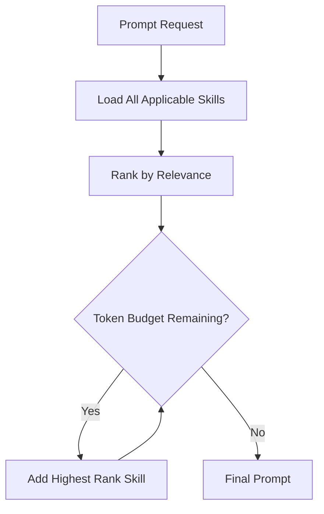

The **Skills System** provides AI agents with domain-specific expertise through structured Markdown skill files that are dynamically loaded and composed into LLM prompts.

## Skill Files

Skills are defined in `skill.md` files with YAML frontmatter and Markdown content.

### Skill Structure

```markdown
---
id: "arbitrage-sumtoone"
name: "Sum-to-One Arbitrage Strategy"
version: "1.0.0"
description: "Detect and execute sum-to-one arbitrage opportunities across exchanges"
category: "arbitrage"
author: "NeuraTrade"
tags: ["arbitrage", "cross-exchange", "low-risk"]
dependencies: ["risk-management", "position-sizing"]
parameters:
  min_spread:
    type: "float"
    description: "Minimum profit spread percentage"
    required: true
    default: 0.5
  max_position:
    type: "float"
    description: "Maximum position size as % of portfolio"
    required: true
    default: 0.1
examples:
  - name: "Basic arbitrage"
    description: "Simple two-exchange arbitrage"
    inputs:
      symbol: "BTC/USDT"
      buy_exchange: "binance"
      sell_exchange: "kraken"
      spread: 0.8
    expected:
      action: "execute"
      confidence: 0.9
---

# Sum-to-One Arbitrage Strategy

## Overview
Sum-to-one arbitrage exploits price discrepancies across exchanges...

## Detection
1. Monitor ticker prices across all configured exchanges
2. Calculate spread: `(highest_bid - lowest_ask) / lowest_ask`
3. Subtract fees: `spread - (buy_fee + sell_fee + transfer_fee)`
4. If net spread > min_spread, trigger opportunity

## Execution
1. Verify sufficient balance on both exchanges
2. Place simultaneous buy and sell orders
3. Monitor fills and adjust if partial fills occur
4. Transfer funds if needed for balance

## Risk Factors
- **Execution Risk**: Prices move before orders fill
- **Transfer Risk**: Delays in fund transfers between exchanges
- **Liquidity Risk**: Insufficient order book depth

## Example
```
BTC/USDT on Binance: $50,000 (ask)
BTC/USDT on Kraken: $50,500 (bid)
Spread: 1.0%
Fees: 0.3% (total)
Net Profit: 0.7%
```
```

### Skill Loading

```go
// services/backend-api/internal/skill/loader.go:52-98
type Skill struct {
    ID           string                 `yaml:"id"`
    Name         string                 `yaml:"name"`
    Version      string                 `yaml:"version"`
    Description  string                 `yaml:"description"`
    Category     string                 `yaml:"category"`
    Tags         []string               `yaml:"tags"`
    Dependencies []string               `yaml:"dependencies"`
    Parameters   map[string]Param       `yaml:"parameters"`
    Examples     []Example              `yaml:"examples"`
    Content      string                 // Markdown content
    SourcePath   string                 // File path
}

loader := skill.NewLoader("./skills")
skills, err := loader.LoadAll()
```

<Info>
Skill loader implementation: `services/backend-api/internal/skill/loader.go:59-150`
</Info>

---

## Prompt Building

Skills are dynamically composed into LLM prompts using **progressive disclosure**.

### Prompt Builder

```go
type PromptBuilder struct {
    skillLoader  *skill.Loader
    contextLimit int  // Max tokens for context
}

func (pb *PromptBuilder) BuildPrompt(opts PromptOptions) (string, error) {
    // 1. Load required skills
    skills := pb.loadSkills(opts.RequiredSkills)
    
    // 2. Build system prompt
    systemPrompt := pb.buildSystemPrompt(opts.AgentRole)
    
    // 3. Add skill content (progressive disclosure)
    skillContent := pb.addSkills(skills, opts.Priority)
    
    // 4. Add market context
    marketContext := pb.addMarketContext(opts.Symbol, opts.Timeframe)
    
    // 5. Add user instruction
    userInstruction := opts.Instruction
    
    return fmt.Sprintf("%s\n\n%s\n\n%s\n\n%s",
        systemPrompt, skillContent, marketContext, userInstruction)
}
```

### Progressive Disclosure

Skills are included in prompts based on **relevance and token budget**:



### Skill Prioritization

```go
func (pb *PromptBuilder) rankSkills(skills []*Skill, context Context) []*RankedSkill {
    ranked := make([]*RankedSkill, 0, len(skills))
    
    for _, skill := range skills {
        score := 0.0
        
        // Required skills get highest priority
        if contains(context.RequiredSkills, skill.ID) {
            score += 100.0
        }
        
        // Category match
        if skill.Category == context.Category {
            score += 50.0
        }
        
        // Tag match
        for _, tag := range skill.Tags {
            if contains(context.Tags, tag) {
                score += 10.0
            }
        }
        
        // Recently used skills get bonus
        if wasRecentlyUsed(skill.ID) {
            score += 20.0
        }
        
        ranked = append(ranked, &RankedSkill{
            Skill: skill,
            Score: score,
        })
    }
    
    sort.Slice(ranked, func(i, j int) bool {
        return ranked[i].Score > ranked[j].Score
    })
    
    return ranked
}
```

---

## Built-in Skills

NeuraTrade includes several pre-built skills:

<AccordionGroup>
  <Accordion title="arbitrage-sumtoone.md">
    **Sum-to-One Arbitrage Strategy**
    
    - Cross-exchange price arbitrage
    - Simultaneous buy/sell execution
    - Fee-adjusted profit calculation
    - Risk: execution slippage, transfer delays
  </Accordion>
  
  <Accordion title="scalping.md">
    **Scalping Strategy**
    
    - High-frequency small profit trades
    - Tight stop-loss (0.5-1%)
    - Quick exits (1-5 minute holds)
    - Risk: high transaction costs, whipsaw
  </Accordion>
  
  <Accordion title="risk-management.md">
    **Risk Management Primitives**
    
    - Position sizing (Kelly Criterion)
    - Stop-loss placement (ATR-based)
    - Daily loss limits
    - Drawdown thresholds
  </Accordion>
  
  <Accordion title="market-regime.md">
    **Market Regime Detection**
    
    - Trending vs. ranging markets
    - High vs. low volatility
    - Risk-on vs. risk-off sentiment
    - Adapt strategies to regime
  </Accordion>
  
  <Accordion title="position-sizing.md">
    **Position Sizing Methods**
    
    - Fixed percentage (1-2% risk per trade)
    - Kelly Criterion (optimal bet sizing)
    - Volatility-adjusted sizing (ATR-based)
    - Risk parity across positions
  </Accordion>
</AccordionGroup>

<Info>
Skill files are located in `services/backend-api/internal/skill/` (if exists) or referenced in code.
</Info>

---

## Skill Composition

Multiple skills can be composed for complex strategies:

```go
// Compose arbitrage + risk management
prompt := builder.BuildPrompt(PromptOptions{
    AgentRole: "trader",
    RequiredSkills: []string{
        "arbitrage-sumtoone",
        "risk-management",
        "position-sizing",
    },
    Instruction: "Evaluate this arbitrage opportunity and recommend position size",
    Symbol: "BTC/USDT",
    Context: arbitrageOpportunity,
})
```

### Dependency Resolution

Skills can declare dependencies that are auto-loaded:

```yaml
---
id: "arbitrage-sumtoone"
dependencies: ["risk-management", "position-sizing"]
---
```

When loading `arbitrage-sumtoone`, the loader automatically includes:
1. `arbitrage-sumtoone.md` (primary skill)
2. `risk-management.md` (dependency)
3. `position-sizing.md` (dependency)

---

## Skill Parameters

Skills can accept parameters for customization:

```yaml
parameters:
  min_spread:
    type: "float"
    description: "Minimum profit spread percentage"
    required: true
    default: 0.5
  max_position:
    type: "float"
    description: "Maximum position size as % of portfolio"
    required: true
    default: 0.1
  exchanges:
    type: "array"
    description: "List of exchanges to monitor"
    required: false
    default: ["binance", "kraken", "coinbase"]
```

Parameters are injected into the prompt:

```go
params := map[string]interface{}{
    "min_spread": 0.8,
    "max_position": 0.05,
}

prompt := builder.BuildPrompt(PromptOptions{
    RequiredSkills: []string{"arbitrage-sumtoone"},
    Parameters: params,
})
```

---

## Skill Examples

Skills include examples for few-shot learning:

```yaml
examples:
  - name: "Basic arbitrage"
    description: "Simple two-exchange arbitrage"
    inputs:
      symbol: "BTC/USDT"
      buy_exchange: "binance"
      sell_exchange: "kraken"
      spread: 0.8
    expected:
      action: "execute"
      confidence: 0.9
      reasoning: "Spread exceeds minimum threshold after fees"
  
  - name: "Rejected arbitrage"
    description: "Spread too small after fees"
    inputs:
      symbol: "ETH/USDT"
      buy_exchange: "binance"
      sell_exchange: "kraken"
      spread: 0.3
    expected:
      action: "skip"
      confidence: 0.95
      reasoning: "Net spread (0.0%) below minimum threshold (0.5%) after fees"
```

Examples are formatted as few-shot examples in the prompt:

```
Here are some examples of how to apply this skill:

Example 1: Basic arbitrage
Input: {"symbol": "BTC/USDT", "buy_exchange": "binance", ...}
Output: {"action": "execute", "confidence": 0.9, ...}
Reasoning: Spread exceeds minimum threshold after fees

Example 2: Rejected arbitrage
Input: {"symbol": "ETH/USDT", "buy_exchange": "binance", ...}
Output: {"action": "skip", "confidence": 0.95, ...}
Reasoning: Net spread (0.0%) below minimum threshold (0.5%) after fees
```

---

## Token Budget Management

Prompt builder respects token limits:

```go
type PromptBudget struct {
    MaxTokens        int  // Total token limit (e.g., 8000)
    SystemPrompt     int  // Reserved for system prompt (e.g., 500)
    MarketContext    int  // Reserved for market data (e.g., 1000)
    UserInstruction  int  // Reserved for user message (e.g., 500)
    SkillsAvailable  int  // Remaining for skills (6000)
}

func (pb *PromptBuilder) fitSkills(skills []*RankedSkill, budget int) []*Skill {
    fitted := []*Skill{}
    usedTokens := 0
    
    for _, ranked := range skills {
        skillTokens := estimateTokens(ranked.Skill.Content)
        if usedTokens + skillTokens <= budget {
            fitted = append(fitted, ranked.Skill)
            usedTokens += skillTokens
        } else {
            break  // Budget exhausted
        }
    }
    
    return fitted
}
```

<Tip>
High-priority skills are added first. If token budget is exhausted, lower-priority skills are omitted.
</Tip>

---

## Skill Versioning

Skills are versioned for reproducibility:

```yaml
---
id: "arbitrage-sumtoone"
version: "1.2.0"
---
```

Version history is tracked:

```go
type SkillVersion struct {
    Version     string
    Content     string
    CreatedAt   time.Time
    Deprecated  bool
    UpgradePath string  // Next version ID
}

// Load specific version
skill, err := loader.LoadVersion("arbitrage-sumtoone", "1.0.0")

// Load latest
skill, err := loader.LoadByID("arbitrage-sumtoone")
```

---

## Creating Custom Skills

### Skill Template

```markdown
---
id: "my-custom-strategy"
name: "My Custom Trading Strategy"
version: "1.0.0"
description: "Brief description of what this skill does"
category: "trading"  # arbitrage, scalping, swing, etc.
author: "Your Name"
tags: ["custom", "experimental"]
dependencies: []  # Other skill IDs
parameters:
  param1:
    type: "float"
    description: "Parameter description"
    required: true
    default: 1.0
examples:
  - name: "Example 1"
    description: "What this example demonstrates"
    inputs:
      symbol: "BTC/USDT"
    expected:
      action: "buy"
---

# My Custom Trading Strategy

## Overview
Detailed explanation of the strategy...

## Entry Criteria
1. Condition 1
2. Condition 2
3. Condition 3

## Exit Criteria
1. Stop-loss: X%
2. Take-profit: Y%
3. Time-based: Z hours

## Risk Management
- Max position size: A%
- Max concurrent positions: B
- Daily loss limit: $C

## Example Trade
```
Entry: $50,000
Stop: $49,000 (-2%)
Target: $53,000 (+6%)
Risk:Reward = 1:3
```
```

### Adding Skills

1. Create `my-skill.md` in skills directory
2. Reload skill loader:
   ```go
   loader.LoadAll()  // Reloads all skills
   ```
3. Reference in prompts:
   ```go
   RequiredSkills: []string{"my-custom-strategy"}
   ```

---

## Next Steps

<CardGroup cols={2}>
  <Card title="AI Reasoning" icon="lightbulb" href="/architecture/ai/reasoning">
    LLM provider registry and failover chains
  </Card>
  <Card title="Quest Engine" icon="clock" href="/architecture/quest-engine">
    How quests invoke AI agents
  </Card>
</CardGroup>
