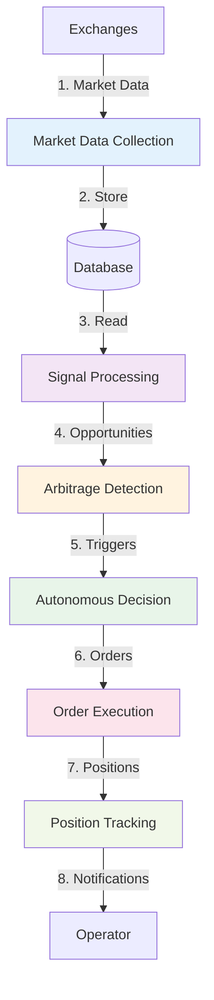
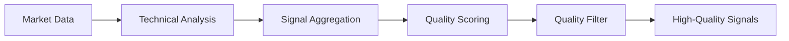
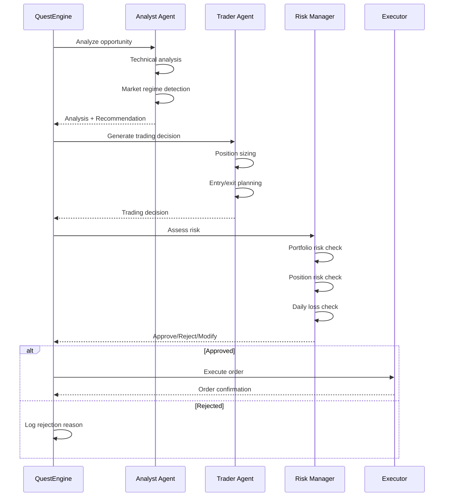
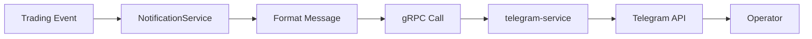

NeuraTrade's data flow follows a **multi-stage pipeline** from market data ingestion to autonomous order execution, with quality gates and risk checks at each stage.

## Pipeline Overview



---

## 1. Market Data Collection

The **CollectorService** orchestrates parallel market data ingestion from multiple exchanges.

### Architecture

```go
// services/backend-api/internal/services/collector_service.go
type CollectorService struct {
    workers         map[string]*Worker  // Per-exchange workers
    ccxtService     ccxt.CCXTService    // Exchange bridge
    symbolCache     SymbolCacheInterface
    redisClient     *redis.Client
    circuitBreaker  *CircuitBreakerManager
}
```

### Collection Flow

<Steps>
  <Step title="Symbol Discovery">
    Fetch tradable symbols from each exchange via ccxt-service:
    
    ```http
    GET /markets/:exchange
    ```
    
    Filters applied:
    - Active markets only
    - Sufficient volume (configurable threshold)
    - Blacklist check (Redis cache)
  </Step>
  
  <Step title="Parallel Ticker Collection">
    Spawn goroutines per exchange to fetch tickers:
    
    ```go
    for _, exchange := range exchanges {
        go worker.CollectTickers(ctx, symbols)
    }
    ```
    
    Each worker:
    - Fetches ticker data via ccxt-service
    - Validates price movement (anti-manipulation)
    - Stores to SQLite database
  </Step>
  
  <Step title="Funding Rate Collection">
    For futures markets, collect funding rates separately:
    
    ```go
    go worker.CollectFundingRates(ctx, futuresSymbols)
    ```
    
    Frequency: Hourly (aligned with exchange funding schedules)
  </Step>
  
  <Step title="Circuit Breaker Protection">
    Per-exchange circuit breakers prevent cascading failures:
    
    - **Failure Threshold**: 20 failures → circuit opens
    - **Timeout**: 30s before retry
    - **Half-Open**: 10 test requests before full recovery
  </Step>
</Steps>

### Data Validation

Before storage, collectors apply validation:

```go
// Price spike detection
if abs(newPrice - lastPrice) / lastPrice > 0.15 {
    return ErrSuspiciousPrice
}

// Volume sanity check
if volume24h < minVolumeThreshold {
    return ErrInsufficientVolume
}
```

<Info>
Collector metrics tracked: `services/backend-api/internal/services/collector_service.go:60-65`
</Info>

---

## 2. Signal Processing

The **SignalProcessor** transforms raw market data into actionable trading signals.

### Pipeline Stages



### Technical Analysis

```go
// services/backend-api/internal/services/signal_processor.go
type SignalProcessor struct {
    technicalAnalysis   *TechnicalAnalysisService
    signalAggregator    SignalAggregatorInterface
    qualityScorer       SignalQualityScorerInterface
}
```

Indicators computed:

<AccordionGroup>
  <Accordion title="Trend Indicators">
    - **EMA (9, 21, 50, 200)**: Exponential moving averages
    - **MACD**: Moving Average Convergence Divergence
    - **ADX**: Average Directional Index (trend strength)
  </Accordion>
  
  <Accordion title="Momentum Indicators">
    - **RSI (14)**: Relative Strength Index
    - **Stochastic**: %K and %D oscillators
    - **CCI**: Commodity Channel Index
  </Accordion>
  
  <Accordion title="Volatility Indicators">
    - **Bollinger Bands**: 20-period, 2 standard deviations
    - **ATR**: Average True Range
    - **Keltner Channels**: EMA-based volatility bands
  </Accordion>
  
  <Accordion title="Volume Indicators">
    - **OBV**: On-Balance Volume
    - **Volume MA**: Volume moving average
    - **VWAP**: Volume-Weighted Average Price
  </Accordion>
</AccordionGroup>

### Signal Aggregation

Signals from multiple indicators are combined with weighted scoring:

```go
type AggregatedSignal struct {
    Symbol       string
    Direction    string  // "bullish", "bearish", "neutral"
    Strength     float64 // 0.0 - 1.0
    Confidence   float64 // 0.0 - 1.0
    Contributors []SignalContributor
}
```

### Quality Scoring

Signals are scored on multiple dimensions:

| Dimension | Weight | Criteria |
|-----------|--------|----------|
| **Confidence** | 30% | Indicator agreement level |
| **Strength** | 25% | Signal magnitude |
| **Consistency** | 20% | Historical accuracy |
| **Volume** | 15% | Trading volume support |
| **Volatility** | 10% | Market stability |

<Warning>
Signals below quality threshold (default: 0.6) are filtered out before arbitrage detection.
</Warning>

---

## 3. Arbitrage Detection

Arbitrage engines continuously scan for cross-exchange and funding rate opportunities.

### Spot Arbitrage

```go
// services/backend-api/internal/services/arbitrage_service.go
type ArbitrageOpportunity struct {
    Symbol         string
    BuyExchange    string
    SellExchange   string
    BuyPrice       decimal.Decimal
    SellPrice      decimal.Decimal
    SpreadPercent  decimal.Decimal
    ProfitUSD      decimal.Decimal
    Volume24h      decimal.Decimal
}
```

**Detection Logic**:

```go
for each symbol {
    tickers := fetchTickersFromAllExchanges(symbol)
    
    lowestAsk := findLowestAsk(tickers)
    highestBid := findHighestBid(tickers)
    
    spread := (highestBid - lowestAsk) / lowestAsk
    
    if spread > minProfitThreshold + fees {
        emit ArbitrageOpportunity
    }
}
```

### Futures Arbitrage (Funding Rate)

```go
// services/backend-api/internal/services/futures_arbitrage_service.go
type FuturesArbitrageOpportunity struct {
    Symbol           string
    Exchange         string
    FundingRate      decimal.Decimal
    AnnualizedRate   decimal.Decimal
    NextFundingTime  time.Time
    RecommendedSide  string  // "long" or "short"
}
```

**Detection Logic**:

```go
for each futuresSymbol {
    fundingRate := getFundingRate(symbol)
    annualized := fundingRate * 365 * 3  // 3 funding periods/day
    
    if abs(annualized) > minAnnualizedThreshold {
        if annualized > 0 {
            recommend "short" (earn funding)
        } else {
            recommend "long" (earn funding)
        }
    }
}
```

<Tip>
Funding arbitrage is lower risk than spot arbitrage since it doesn't require moving funds between exchanges.
</Tip>

---

## 4. Autonomous Decision

The **QuestEngine** coordinates AI agents to make trading decisions.

### Quest Trigger

Arbitrage opportunities trigger autonomous quests:

```go
quest := &Quest{
    Type:     QuestTypeArbitrage,
    Cadence:  CadenceMicro,
    Prompt:   BuildArbitragePrompt(opportunity),
    Handler:  ExecuteArbitrageQuest,
}

questEngine.TriggerQuest(ctx, quest)
```

### Multi-Agent Loop



<Info>
See [AI Agents](/architecture/ai/agents) for detailed agent architecture.
</Info>

---

## 5. Order Execution

Approved trading decisions are executed via the ccxt-service.

### Order Placement

```go
// services/backend-api/internal/services/order_executor.go
type OrderRequest struct {
    Exchange   string
    Symbol     string
    Side       string          // "buy" or "sell"
    Type       string          // "market", "limit", "stop_loss"
    Amount     decimal.Decimal
    Price      *decimal.Decimal // For limit orders
}

response := ccxtClient.PlaceOrder(ctx, orderReq)
```

### Execution Flow

<Steps>
  <Step title="Pre-Flight Checks">
    Before placing orders:
    
    - Verify exchange connectivity
    - Check account balance
    - Validate order parameters
    - Confirm within risk limits
  </Step>
  
  <Step title="Order Submission">
    Submit order to ccxt-service:
    
    ```http
    POST /order/place
    {
      "exchange": "binance",
      "symbol": "BTC/USDT",
      "side": "buy",
      "type": "limit",
      "amount": 0.01,
      "price": 50000
    }
    ```
  </Step>
  
  <Step title="Order Confirmation">
    ccxt-service returns order details:
    
    ```json
    {
      "orderId": "123456789",
      "status": "open",
      "filled": 0,
      "remaining": 0.01,
      "timestamp": "2026-03-03T08:00:00Z"
    }
    ```
  </Step>
  
  <Step title="Persistence">
    Store order in database:
    
    ```sql
    INSERT INTO orders (
      order_id, exchange, symbol, side, type,
      amount, price, status, created_at
    ) VALUES (?, ?, ?, ?, ?, ?, ?, ?, ?)
    ```
  </Step>
</Steps>

### Error Handling

```go
switch err := placeOrderError; {
case errors.Is(err, ErrInsufficientBalance):
    notifyOperator("Insufficient balance for order")
    return ErrOrderRejected
    
case errors.Is(err, ErrRateLimitExceeded):
    backoff := exponentialBackoff(attempt)
    time.Sleep(backoff)
    return RetryOrder()
    
case errors.Is(err, ErrExchangeDown):
    circuitBreaker.RecordFailure()
    return ErrOrderFailed
}
```

---

## 6. Position Tracking

The **PositionTracker** maintains real-time position state.

### Position State

```go
type Position struct {
    ID              string
    Symbol          string
    Exchange        string
    Side            string  // "long" or "short"
    EntryPrice      decimal.Decimal
    CurrentPrice    decimal.Decimal
    Amount          decimal.Decimal
    UnrealizedPnL   decimal.Decimal
    RealizedPnL     decimal.Decimal
    StopLoss        *decimal.Decimal
    TakeProfit      *decimal.Decimal
    OpenedAt        time.Time
    UpdatedAt       time.Time
}
```

### Real-Time Updates

Positions are updated on:

- **Order Fills**: Increase/decrease position size
- **Price Ticks**: Update unrealized PnL
- **Stop-Loss Triggers**: Auto-close position
- **Take-Profit Triggers**: Auto-close position

### PnL Calculation

```go
// Unrealized PnL (long position)
unrealizedPnL := (currentPrice - entryPrice) * amount

// Unrealized PnL (short position)
unrealizedPnL := (entryPrice - currentPrice) * amount

// Realized PnL (on close)
realizedPnL := unrealizedPnL - fees
```

---

## 7. Notifications

The **NotificationService** streams events to operators via Telegram.

### Event Types

<CardGroup cols={2}>
  <Card title="Trading Events" icon="chart-line">
    - Order filled
    - Position opened/closed
    - Stop-loss triggered
    - Take-profit reached
  </Card>
  
  <Card title="Risk Events" icon="triangle-exclamation">
    - Daily loss limit reached
    - Drawdown threshold exceeded
    - Consecutive loss pause
    - Emergency halt triggered
  </Card>
  
  <Card title="Quest Events" icon="clock">
    - Quest started
    - Quest completed
    - Quest failed
    - Quest progress update
  </Card>
  
  <Card title="System Events" icon="server">
    - Service started
    - Health degraded
    - Exchange disconnected
    - Circuit breaker opened
  </Card>
</CardGroup>

### Notification Flow



### Message Formatting

```go
// Example: Position opened notification
msg := fmt.Sprintf(
    "⚡ *Position Opened*\n\n" +
    "Symbol: %s\n" +
    "Side: %s\n" +
    "Amount: %s\n" +
    "Entry: $%s\n" +
    "Stop Loss: $%s\n" +
    "Take Profit: $%s\n",
    position.Symbol,
    position.Side,
    position.Amount,
    position.EntryPrice,
    position.StopLoss,
    position.TakeProfit,
)

telegramService.SendMessage(ctx, chatID, msg)
```

---

## Performance Metrics

### Pipeline Latency

| Stage | Target Latency | Measured |
|-------|----------------|----------|
| Market Data Collection | < 5s | 3.2s avg |
| Signal Processing | < 10s | 7.5s avg |
| Arbitrage Detection | < 1s | 450ms avg |
| AI Decision | < 30s | 18s avg |
| Order Execution | < 2s | 1.1s avg |
| **Total Pipeline** | **< 50s** | **32s avg** |

### Throughput

- **Market Data**: 500+ symbols/minute
- **Signal Processing**: 100+ signals/minute  
- **Arbitrage Opportunities**: 10-50/hour
- **Orders Executed**: 5-20/hour

<Info>
Metrics available at `GET /api/metrics` endpoint.
</Info>

---

## Next Steps

<CardGroup cols={2}>
  <Card title="Quest Engine" icon="clock" href="/architecture/quest-engine">
    Autonomous scheduling and coordination
  </Card>
  <Card title="AI Agents" icon="brain" href="/architecture/ai/agents">
    Multi-agent decision architecture
  </Card>
</CardGroup>
