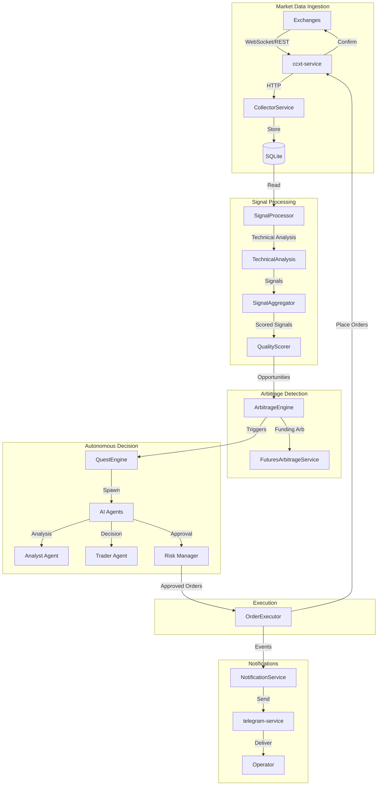

NeuraTrade is a multi-service crypto trading platform built with a **Go backend** and **Bun TypeScript sidecar services** for exchange and Telegram integrations. The architecture is designed for native-first deployment with robust autonomous trading capabilities.

## Multi-Service Design

NeuraTrade follows a service-oriented architecture with three core services:

<CardGroup cols={3}>
  <Card title="backend-api" icon="server" href="/architecture/services#backend-api">
    Go API server with domain logic, persistence, and autonomous orchestration
  </Card>
  <Card title="ccxt-service" icon="code" href="/architecture/services#ccxt-service">
    Bun + CCXT exchange bridge for unified exchange access
  </Card>
  <Card title="telegram-service" icon="paper-plane" href="/architecture/services#telegram-service">
    Bun + grammY bot for notifications and operator interaction
  </Card>
</CardGroup>

### Design Philosophy

<Info>
**Go for Performance**: Backend API leverages Go's concurrency model for high-throughput market data processing and real-time arbitrage detection.
</Info>

<Info>
**TypeScript for Ecosystem**: Sidecar services use Bun + TypeScript to leverage mature exchange (CCXT) and bot (grammY) libraries.
</Info>

## Technology Stack

```text
┌─────────────────────────────────────────────────────────────┐
│                    NeuraTrade Platform                      │
├─────────────────────────────────────────────────────────────┤
│  Backend API (Go 1.26+)                                     │
│  ├─ REST API (Gin framework)                                │
│  ├─ Domain Services (trading logic)                         │
│  ├─ AI Agents (Analyst, Trader, Risk Manager)               │
│  └─ Quest Engine (autonomous scheduling)                    │
├─────────────────────────────────────────────────────────────┤
│  Sidecar Services (Bun 1.3+ / TypeScript)                   │
│  ├─ ccxt-service (HTTP + gRPC)                              │
│  └─ telegram-service (HTTP + gRPC)                          │
├─────────────────────────────────────────────────────────────┤
│  Data Layer                                                 │
│  ├─ SQLite (default runtime database)                       │
│  └─ Redis (caches, queues, distributed locks)               │
└─────────────────────────────────────────────────────────────┘
```

### Core Components

| Component | Technology | Purpose |
|-----------|-----------|----------|
| Backend API | Go 1.26+ | Trading logic, arbitrage engines, AI agents, API |
| CCXT Service | Bun + CCXT | Exchange communication and order execution |
| Telegram Service | Bun + grammY | Bot commands and notification delivery |
| Database | SQLite | Persistent storage for trades, signals, positions |
| Cache | Redis | Real-time state, distributed locks, queues |

## Native-First Deployment

NeuraTrade is designed for **native binary deployment** without container dependencies:

```bash
# Build all services
make build

# Start all services natively
./bin/neuratrade gateway start

# Check health
curl http://localhost:8080/health
```

### Process Management

The `neuratrade` CLI orchestrates all services:

- **Single Gateway**: One command to start/stop all services
- **Process Monitoring**: Health checks and automatic restarts
- **Native PIDs**: Services run as native OS processes
- **Runtime State**: Stored in `NEURATRADE_HOME` (default: `~/.neuratrade`)

<Tip>
Native deployment provides faster startup times, easier debugging, and lower resource overhead compared to containerized deployments.
</Tip>

## Data Flow Overview



<Info>
See [Data Flow](/architecture/data-flow) for detailed pipeline documentation.
</Info>

## Service Communication

Services communicate via multiple protocols optimized for their use cases:

### HTTP/REST
- Backend API → CCXT Service (exchange operations)
- Backend API → Telegram Service (notifications)
- External clients → Backend API (public API)

### gRPC
- Backend API ↔ Telegram Service (delivery hooks)
- Backend API ↔ CCXT Service (streaming data)

### Redis PubSub
- Quest triggers and events
- Real-time position updates
- Emergency kill switch

<CardGroup cols={2}>
  <Card title="Service Architecture" icon="cubes" href="/architecture/services">
    Detailed service design and communication patterns
  </Card>
  <Card title="Quest Engine" icon="robot" href="/architecture/quest-engine">
    Autonomous scheduling and quest orchestration
  </Card>
</CardGroup>

## Key Architectural Decisions

<AccordionGroup>
  <Accordion title="Why Go for the backend?">
    Go provides:
    - **Concurrency**: Goroutines for parallel market data collection
    - **Performance**: Sub-millisecond arbitrage detection
    - **Type Safety**: Decimal types for money math (no float errors)
    - **Deployment**: Single binary with no runtime dependencies
  </Accordion>
  
  <Accordion title="Why Bun/TypeScript for sidecars?">
    Bun + TypeScript offers:
    - **Ecosystem**: Mature CCXT library for 100+ exchanges
    - **Bot Framework**: grammY for Telegram integration
    - **Fast Startup**: Bun's performance for sidecar services
    - **Type Safety**: TypeScript for API contracts
  </Accordion>
  
  <Accordion title="Why SQLite instead of PostgreSQL?">
    SQLite is the default runtime database because:
    - **Zero Config**: No separate database server to manage
    - **Single File**: Easy backup and migration
    - **Performance**: Fast for read-heavy workloads
    - **ACID**: Full transactional support
    
    <Info>PostgreSQL is supported for production deployments requiring multi-instance scaling.</Info>
  </Accordion>
  
  <Accordion title="Why Redis?">
    Redis provides:
    - **Distributed Locks**: Quest coordination across instances
    - **PubSub**: Real-time event streaming
    - **Caching**: Market data and API response caching
    - **Queues**: Asynchronous job processing
  </Accordion>
</AccordionGroup>

## Next Steps

<CardGroup cols={2}>
  <Card title="Services" icon="cubes" href="/architecture/services">
    Deep dive into each service's responsibilities
  </Card>
  <Card title="Data Flow" icon="diagram-next" href="/architecture/data-flow">
    Complete data processing pipeline
  </Card>
  <Card title="Quest Engine" icon="clock" href="/architecture/quest-engine">
    Autonomous scheduling and execution
  </Card>
  <Card title="AI Agents" icon="brain" href="/architecture/ai/agents">
    Multi-agent decision system
  </Card>
</CardGroup>
