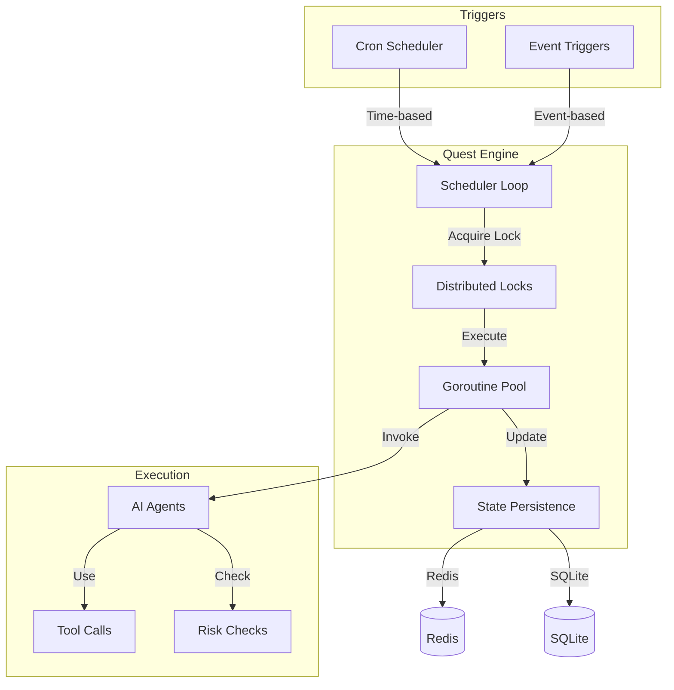
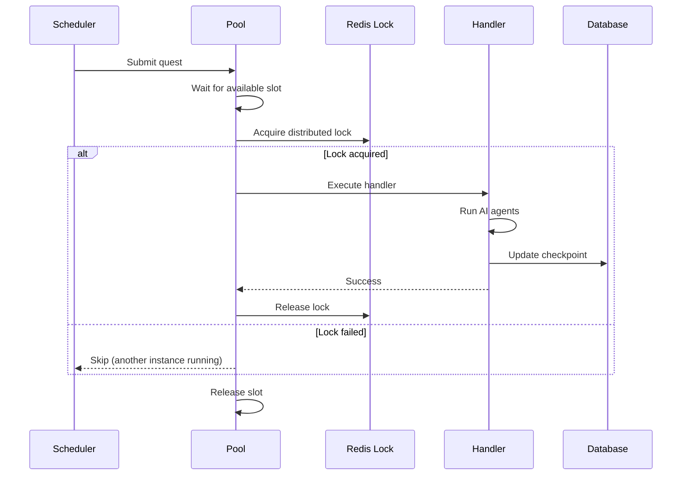
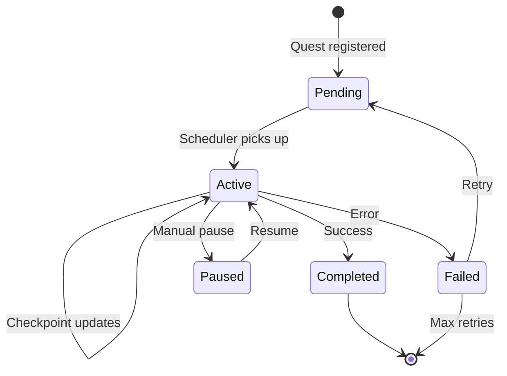

The **QuestEngine** is NeuraTrade's autonomous orchestration system that schedules and executes trading quests with distributed coordination, priority management, and fault tolerance.

## Overview

Quests are schedulable tasks representing autonomous trading activities:

- **Routine Quests**: Time-triggered (cron-based)
- **Triggered Quests**: Event-driven (arbitrage opportunities, alerts)
- **Goal Quests**: Milestone-driven (profit targets, position goals)
- **Arbitrage Quests**: Opportunity execution workflows

```go
// services/backend-api/internal/services/quest_engine.go:85-104
type Quest struct {
    ID             string
    Name           string
    Type           QuestType
    Cadence        QuestCadence  // micro, hourly, daily, weekly, onetime
    Status         QuestStatus   // pending, active, completed, failed, paused
    Priority       Priority      // CRITICAL > HIGH > NORMAL > LOW
    Prompt         string        // AI agent prompt
    Handler        QuestHandler  // Execution function
    LastExecutedAt *time.Time
    Checkpoint     map[string]interface{}
}
```

---

## Architecture

### Core Components



---

## Cron Scheduling

Routine quests run on predefined schedules using cron expressions.

### Cadence Types

| Cadence | Interval | Use Case |
|---------|----------|----------|
| **Micro** | 1-5 minutes | Real-time arbitrage scanning |
| **Hourly** | Every hour | Market analysis, funding rate checks |
| **Daily** | Once per day | Portfolio rebalancing, performance reports |
| **Weekly** | Once per week | Deep analysis, strategy optimization |
| **Onetime** | Single execution | One-off tasks, migrations |

### Cron Expressions

```go
// Define quest with custom cron schedule
quest := &Quest{
    Name:     "Funding Rate Analysis",
    Type:     QuestTypeRoutine,
    CronExpr: "0 */1 * * *",  // Every hour on the hour
    Handler:  analyzeFundingRates,
}

questEngine.RegisterQuest(quest)
```

### Scheduler Loop

The main scheduler runs every 5 seconds:

```go
func (qe *QuestEngine) schedulerLoop() {
    ticker := time.NewTicker(5 * time.Second)
    defer ticker.Stop()
    
    for {
        select {
        case <-ticker.C:
            qe.evaluateQuests()
        case <-qe.ctx.Done():
            return
        }
    }
}

func (qe *QuestEngine) evaluateQuests() {
    for _, quest := range qe.getActiveQuests() {
        if qe.shouldExecute(quest) {
            qe.executeQuest(quest)
        }
    }
}
```

<Info>
Scheduler poll interval: `services/backend-api/internal/services/quest_engine.go:30`
</Info>

---

## Event Triggers

Triggered quests execute immediately when specific events occur.

### Event Types

<AccordionGroup>
  <Accordion title="Arbitrage Opportunities">
    When arbitrage engines detect profitable opportunities:
    
    ```go
    arbitrageService.OnOpportunity(func(opp *ArbitrageOpportunity) {
        quest := &Quest{
            Name:    fmt.Sprintf("Arbitrage: %s", opp.Symbol),
            Type:    QuestTypeArbitrage,
            Prompt:  BuildArbitragePrompt(opp),
            Handler: ExecuteArbitrageQuest,
        }
        questEngine.TriggerQuest(ctx, quest)
    })
    ```
  </Accordion>
  
  <Accordion title="Risk Alerts">
    When risk thresholds are exceeded:
    
    ```go
    riskManager.OnDrawdownAlert(func(alert *DrawdownAlert) {
        quest := &Quest{
            Name:     "Emergency Risk Review",
            Type:     QuestTypeTriggered,
            Priority: PriorityCritical,
            Handler:  ReviewRiskAndAct,
        }
        questEngine.TriggerQuest(ctx, quest)
    })
    ```
  </Accordion>
  
  <Accordion title="Market Regime Changes">
    When market conditions shift significantly:
    
    ```go
    regimeDetector.OnRegimeChange(func(newRegime MarketRegime) {
        quest := &Quest{
            Name:     "Regime Adaptation",
            Type:     QuestTypeTriggered,
            Priority: PriorityHigh,
            Handler:  AdaptToRegime,
        }
        questEngine.TriggerQuest(ctx, quest)
    })
    ```
  </Accordion>
  
  <Accordion title="Stop-Loss Triggers">
    When positions hit stop-loss levels:
    
    ```go
    positionTracker.OnStopLoss(func(position *Position) {
        quest := &Quest{
            Name:     fmt.Sprintf("Stop Loss: %s", position.Symbol),
            Type:     QuestTypeTriggered,
            Priority: PriorityCritical,
            Handler:  ExecuteStopLoss,
        }
        questEngine.TriggerQuest(ctx, quest)
    })
    ```
  </Accordion>
</AccordionGroup>

---

## Priority Levels

Quests are executed in priority order to ensure critical tasks run first.

### Priority Hierarchy

```go
type Priority string

const (
    PriorityCritical Priority = "CRITICAL"  // Emergency actions, stop-losses
    PriorityHigh     Priority = "HIGH"      // Arbitrage execution, risk alerts
    PriorityNormal   Priority = "NORMAL"    // Regular trading decisions
    PriorityLow      Priority = "LOW"       // Analysis, reports
)
```

### Execution Order

```go
func (qe *QuestEngine) getNextQuest() *Quest {
    qe.mu.RLock()
    defer qe.mu.RUnlock()
    
    // Sort quests by priority, then by creation time
    sorted := sortQuestsByPriority(qe.pendingQuests)
    
    for _, quest := range sorted {
        if !qe.isExecuting(quest.ID) {
            return quest
        }
    }
    return nil
}
```

<Warning>
**CRITICAL** priority quests can interrupt **NORMAL** or **LOW** priority quests if goroutine pool capacity is needed.
</Warning>

---

## Redis Coordination

Redis provides distributed coordination for multi-instance deployments.

### Distributed Locks

Ensure only one instance executes each quest:

```go
func (qe *QuestEngine) acquireLock(questID string) (bool, error) {
    lockKey := fmt.Sprintf("quest:lock:%s", questID)
    lockTTL := 3 * time.Minute
    
    // Try to acquire lock with NX (not exists) flag
    acquired, err := qe.redis.SetNX(
        ctx,
        lockKey,
        qe.instanceID,
        lockTTL,
    ).Result()
    
    return acquired, err
}

func (qe *QuestEngine) releaseLock(questID string) error {
    lockKey := fmt.Sprintf("quest:lock:%s", questID)
    
    // Only release if we own the lock
    script := `
        if redis.call("get", KEYS[1]) == ARGV[1] then
            return redis.call("del", KEYS[1])
        else
            return 0
        end
    `
    
    return qe.redis.Eval(ctx, script, []string{lockKey}, qe.instanceID).Err()
}
```

<Info>
Lock implementation: `services/backend-api/internal/services/quest_engine.go:161`
</Info>

### Lock TTL and Stale Detection

Locks automatically expire to prevent deadlocks:

```go
const (
    defaultQuestExecutionStale = 3 * time.Minute
    questExecutionLockTail     = 35 * time.Second
)

// Lock TTL = execution timeout + lock tail buffer
lockTTL := executionTimeout + questExecutionLockTail
```

Stale quest detection:

```go
func (qe *QuestEngine) detectStaleQuests() {
    for questID, startTime := range qe.executionStarts {
        if time.Since(startTime) > defaultQuestExecutionStale {
            qe.logger.Warn("Stale quest detected", 
                "quest_id", questID,
                "elapsed", time.Since(startTime))
            qe.forceReleaseLock(questID)
        }
    }
}
```

---

## Goroutine Pool

Concurrency is controlled via a goroutine pool with configurable limits.

### Pool Configuration

```go
type QuestEngineConfig struct {
    MaxConcurrentQuests int  // Default: 5
    WorkerPoolSize      int  // Default: 10
}
```

### Pool Implementation

```go
type WorkerPool struct {
    maxWorkers int
    sem        chan struct{}  // Semaphore for concurrency control
}

func (p *WorkerPool) Execute(ctx context.Context, fn func()) error {
    select {
    case p.sem <- struct{}{}:  // Acquire slot
        defer func() { <-p.sem }()  // Release slot
        fn()
        return nil
    case <-ctx.Done():
        return ctx.Err()
    }
}
```

### Execution Flow



---

## State Persistence

Quest state is persisted to survive restarts.

### Checkpoint System

```go
type Quest struct {
    Checkpoint map[string]interface{}  // Arbitrary state
}

// Update checkpoint during execution
func (qe *QuestEngine) updateCheckpoint(questID string, data map[string]interface{}) {
    quest := qe.getQuest(questID)
    for k, v := range data {
        quest.Checkpoint[k] = v
    }
    qe.persistQuest(quest)
}
```

### Storage

Quests are stored in both Redis (hot) and SQLite (persistent):

```go
// Hot state in Redis (fast access)
func (qe *QuestEngine) cacheQuest(quest *Quest) error {
    key := fmt.Sprintf("quest:%s", quest.ID)
    data, _ := json.Marshal(quest)
    return qe.redis.Set(ctx, key, data, 24*time.Hour).Err()
}

// Persistent state in SQLite (durability)
func (qe *QuestEngine) persistQuest(quest *Quest) error {
    query := `
        INSERT OR REPLACE INTO quests (
            id, name, type, status, checkpoint, last_executed_at
        ) VALUES (?, ?, ?, ?, ?, ?)
    `
    checkpointJSON, _ := json.Marshal(quest.Checkpoint)
    return qe.db.Exec(query, quest.ID, quest.Name, quest.Type, 
        quest.Status, checkpointJSON, quest.LastExecutedAt).Error
}
```

---

## Fault Tolerance

### Timeout Management

```go
func (qe *QuestEngine) executeWithTimeout(quest *Quest) error {
    timeout := qe.getQuestTimeout(quest)
    ctx, cancel := context.WithTimeout(qe.ctx, timeout)
    defer cancel()
    
    errChan := make(chan error, 1)
    go func() {
        errChan <- quest.Handler(ctx, quest)
    }()
    
    select {
    case err := <-errChan:
        return err
    case <-ctx.Done():
        return fmt.Errorf("quest timeout after %v", timeout)
    }
}
```

### Retry Logic

```go
func (qe *QuestEngine) executeWithRetry(quest *Quest) error {
    maxRetries := 3
    backoff := time.Second
    
    for attempt := 0; attempt < maxRetries; attempt++ {
        err := qe.execute(quest)
        if err == nil {
            return nil
        }
        
        if !isRetryable(err) {
            return err  // Permanent failure
        }
        
        time.Sleep(backoff)
        backoff *= 2  // Exponential backoff
    }
    
    return fmt.Errorf("quest failed after %d retries", maxRetries)
}
```

### Circuit Breaker

```go
func (qe *QuestEngine) executeWithCircuitBreaker(quest *Quest) error {
    cb := qe.circuitBreakers[quest.Type]
    
    return cb.Execute(func() error {
        return qe.execute(quest)
    })
}
```

<Info>
Circuit breaker config: `services/backend-api/internal/services/quest_engine.go:38-52`
</Info>

---

## Quest Lifecycle



### Status Transitions

```go
func (qe *QuestEngine) transitionStatus(questID string, newStatus QuestStatus) {
    quest := qe.getQuest(questID)
    oldStatus := quest.Status
    
    // Validate transition
    if !isValidTransition(oldStatus, newStatus) {
        return
    }
    
    quest.Status = newStatus
    quest.UpdatedAt = time.Now()
    
    // Emit event
    qe.emitEvent(QuestStatusChanged{
        QuestID:   questID,
        OldStatus: oldStatus,
        NewStatus: newStatus,
    })
    
    qe.persistQuest(quest)
}
```

---

## Monitoring

### Metrics

```go
type QuestEngineMetrics struct {
    TotalQuests       int64
    ActiveQuests      int64
    CompletedQuests   int64
    FailedQuests      int64
    AverageExecTime   time.Duration
    LockContentionRate float64
}
```

### Health Checks

```go
func (qe *QuestEngine) HealthCheck() HealthStatus {
    return HealthStatus{
        Healthy:      qe.isRunning,
        ActiveQuests: len(qe.executing),
        PoolCapacity: qe.pool.Available(),
        RedisHealth:  qe.redis.Ping(ctx).Err() == nil,
    }
}
```

---

## Next Steps

<CardGroup cols={2}>
  <Card title="AI Agents" icon="brain" href="/architecture/ai/agents">
    Multi-agent system invoked by quests
  </Card>
  <Card title="AI Reasoning" icon="lightbulb" href="/architecture/ai/reasoning">
    LLM provider registry and failover
  </Card>
</CardGroup>
