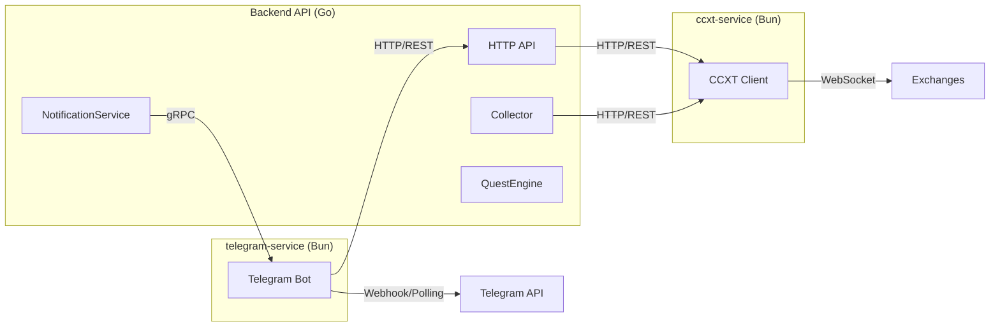

NeuraTrade's service architecture follows a **domain-driven design** with clear service boundaries and explicit communication contracts.

## Service Overview

<CardGroup cols={3}>
  <Card title="backend-api" icon="server">
    **Go 1.26+**
    
    Core trading engine, API, domain logic, persistence, and AI orchestration
  </Card>
  <Card title="ccxt-service" icon="code">
    **Bun + CCXT**
    
    Exchange bridge for unified access to 100+ exchanges
  </Card>
  <Card title="telegram-service" icon="paper-plane">
    **Bun + grammY**
    
    Telegram bot and notification delivery
  </Card>
</CardGroup>

---

## backend-api (Go)

The primary runtime service containing all trading logic, arbitrage engines, AI agents, and API endpoints.

### Structure

```text
services/backend-api/
├── cmd/server/           # Process entrypoint + startup wiring
├── internal/api/         # Routes + HTTP handlers
├── internal/services/    # Trading, signal, collector, orchestration
├── internal/ai/          # LLM providers, registry, reasoning
├── internal/skill/       # Skill loader and prompt building
├── internal/database/    # DB connection + repositories
├── database/             # Migrations + migration tooling
└── scripts/              # Startup, health, env, webhook ops
```

### Core Services

| Service | File | Responsibility |
|---------|------|----------------|
| **CollectorService** | `collector_service.go` | Market data ingestion from exchanges |
| **SignalProcessor** | `signal_processor.go` | Signal pipeline coordination |
| **ArbitrageService** | `arbitrage_service.go` | Spot arbitrage opportunity detection |
| **FuturesArbitrageService** | `futures_arbitrage_service.go` | Funding rate arbitrage engine |
| **QuestEngine** | `quest_engine.go` | Autonomous quest scheduling |
| **AnalystAgent** | `analyst_agent.go` | Market analysis AI agent |
| **TraderAgent** | `trader_agent.go` | Trading decision AI agent |
| **RiskManagerAgent** | `risk/risk_manager_agent.go` | Risk assessment AI agent |
| **NotificationService** | `notification.go` | Telegram notification dispatch |

<Info>
See `services/backend-api/AGENTS.md` for detailed service documentation.
</Info>

### Startup Flow

The backend wiring is **explicit constructor injection** in `cmd/server/main.go`:

```go
// Simplified startup flow
func run() error {
    // 1. Load config
    cfg := config.Load()
    
    // 2. Initialize infrastructure
    db := database.Connect(cfg.DatabaseURL)
    redis := redis.NewClient(cfg.RedisURL)
    
    // 3. Initialize services (order matters!)
    ccxtClient := ccxt.NewClient(cfg.CCXTServiceURL)
    collector := services.NewCollectorService(db, ccxtClient, cfg, redis)
    signalProcessor := services.NewSignalProcessor(db, collector, ...)
    arbitrageService := services.NewArbitrageService(db, signalProcessor, ...)
    questEngine := services.NewQuestEngine(db, redis, ...)
    
    // 4. Initialize AI agents
    analystAgent := services.NewAnalystAgent(llmClient, ...)
    traderAgent := services.NewTraderAgent(llmClient, ...)
    riskManager := risk.NewRiskManagerAgent(llmClient, ...)
    
    // 5. Setup API routes
    router := api.SetupRoutes(arbitrageService, questEngine, ...)
    
    // 6. Start background services
    collector.Start()
    signalProcessor.Start()
    questEngine.Start()
    
    // 7. Start HTTP server
    return router.Run(":8080")
}
```

<Tip>
**No DI Container**: Services are explicitly wired in startup order, making the dependency graph visible and debuggable.
</Tip>

### API Routes

Registered in `internal/api/routes.go`:

| Endpoint | Handler | Purpose |
|----------|---------|----------|
| `GET /health` | HealthHandler | Service health check |
| `GET /api/market/*` | MarketHandler | Market data queries |
| `GET /api/arbitrage/opportunities` | ArbitrageHandler | Spot arbitrage opportunities |
| `GET /api/futures/opportunities` | FuturesArbitrageHandler | Funding rate arbitrage |
| `GET /api/analysis/signals` | SignalHandler | Trading signals |
| `POST /api/autonomous/begin` | AutonomousHandler | Start autonomous mode |
| `POST /api/autonomous/pause` | AutonomousHandler | Pause autonomous mode |
| `GET /api/quests` | QuestHandler | Quest status and progress |

<Info>
See API reference at `/health` for complete endpoint documentation.
</Info>

---

## ccxt-service (Bun)

Bun + TypeScript service providing a unified HTTP/gRPC interface to 100+ exchanges via the CCXT library.

### Structure

```text
services/ccxt-service/
├── index.ts              # Main entrypoint, HTTP + gRPC servers
├── grpc-server.ts        # gRPC service implementation
├── proto/                # Generated protobuf bindings
└── test-setup.ts         # Test mocks and setup
```

### Responsibilities

<CardGroup cols={2}>
  <Card title="Market Data" icon="chart-line">
    - Ticker retrieval
    - Order book snapshots
    - Historical OHLCV data
    - Funding rate queries
  </Card>
  <Card title="Order Execution" icon="circle-check">
    - Place orders (market, limit, stop)
    - Cancel orders
    - Query order status
    - Fetch balances and positions
  </Card>
</CardGroup>

### HTTP Endpoints

```typescript
// Admin endpoints (require ADMIN_API_KEY)
GET  /admin/health              // Service health
POST /admin/init-exchange       // Initialize exchange connection
GET  /admin/exchanges           // List configured exchanges

// Public endpoints
GET  /ticker/:exchange/:symbol  // Get ticker for symbol
POST /order/place               // Place order
POST /order/cancel              // Cancel order
GET  /balance/:exchange         // Get account balance
```

### gRPC Interface

Defined in `protos/ccxt_service.proto`:

```protobuf
service CCXTService {
  rpc GetTicker(TickerRequest) returns (TickerResponse);
  rpc PlaceOrder(OrderRequest) returns (OrderResponse);
  rpc CancelOrder(CancelRequest) returns (CancelResponse);
  rpc GetBalance(BalanceRequest) returns (BalanceResponse);
}
```

<Warning>
**Admin API Key**: Production mode requires `ADMIN_API_KEY` env var. Admin endpoints are disabled if not set.
</Warning>

### Configuration

```bash
# Required
ADMIN_API_KEY=your-secure-key

# Optional
PORT=3000
GRPC_PORT=50051
LOG_LEVEL=info
```

---

## telegram-service (Bun)

Bun + TypeScript service using grammY framework for Telegram bot commands and notification delivery.

### Structure

```text
services/telegram-service/
├── index.ts              # Bot commands, webhook/polling, HTTP server
├── grpc-server.ts        # gRPC delivery interface
├── proto/                # Generated protobuf bindings
└── test-setup.ts         # Test mocks
```

### Bot Commands

| Command | Description |
|---------|-------------|
| `/start` | Initialize bot and bind operator profile |
| `/status` | Show autonomous mode status and active quests |
| `/begin` | Start autonomous trading mode |
| `/pause` | Pause autonomous trading mode |
| `/balance` | Show wallet balances |
| `/positions` | Show open positions |
| `/performance` | Show trading performance summary |
| `/doctor` | Run diagnostic health checks |
| `/liquidate` | Liquidate specific position |
| `/liquidate_all` | Emergency liquidate all positions |

### Notification Types

The service delivers notifications for:

- **Quest Updates**: Quest start, progress, completion
- **Trading Events**: Order fills, position changes, PnL updates
- **Risk Alerts**: Stop-loss triggers, drawdown warnings, emergency halts
- **System Events**: Service starts, health degradation, errors

### HTTP Endpoints

```typescript
GET  /health                    // Service health
POST /admin/send                // Send admin message (requires ADMIN_API_KEY)
POST /webhook                   // Telegram webhook endpoint
```

### gRPC Interface

```protobuf
service TelegramService {
  rpc SendMessage(MessageRequest) returns (MessageResponse);
  rpc SendNotification(NotificationRequest) returns (NotificationResponse);
  rpc HealthCheck(Empty) returns (HealthResponse);
}
```

### Configuration

```bash
# Required
TELEGRAM_BOT_TOKEN=your-bot-token
ADMIN_API_KEY=your-secure-key

# Webhook mode
TELEGRAM_USE_POLLING=false
TELEGRAM_WEBHOOK_URL=https://your-domain.com
TELEGRAM_WEBHOOK_PATH=/webhook
TELEGRAM_WEBHOOK_SECRET=your-webhook-secret

# Backend integration
TELEGRAM_API_BASE_URL=http://localhost:8080
```

<Tip>
Use **polling mode** for local development and **webhook mode** for production deployments.
</Tip>

---

## Service Communication

### Communication Patterns



### Protocol Selection

| Communication | Protocol | Reason |
|--------------|----------|--------|
| Backend → CCXT | HTTP/REST | Request-response pattern, retry logic |
| Backend → Telegram | gRPC | Low latency, streaming, type safety |
| Telegram → Backend | HTTP/REST | Simple webhook integration |
| Services → Redis | Redis Protocol | Distributed locks, PubSub |

---

## Health Checks

All services expose health check endpoints:

### Backend API

```bash
curl http://localhost:8080/health
```

Returns:
```json
{
  "status": "healthy",
  "services": {
    "database": "up",
    "redis": "up",
    "ccxt_service": "up",
    "telegram_service": "up"
  },
  "timestamp": "2026-03-03T08:00:00Z"
}
```

### CCXT Service

```bash
curl http://localhost:3000/admin/health \
  -H "X-Admin-API-Key: your-key"
```

### Telegram Service

```bash
curl http://localhost:3001/health
```

<Info>
Health checks validate:
- Service process is running
- Database connectivity
- Redis connectivity  
- Exchange API accessibility
- Telegram API accessibility
</Info>

---

## Next Steps

<CardGroup cols={2}>
  <Card title="Data Flow" icon="diagram-next" href="/architecture/data-flow">
    See how data flows through services
  </Card>
  <Card title="Quest Engine" icon="clock" href="/architecture/quest-engine">
    Autonomous scheduling architecture
  </Card>
</CardGroup>
