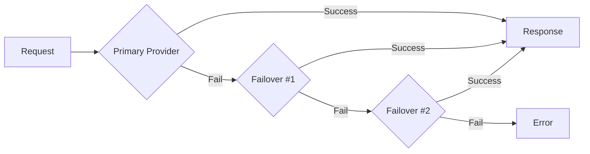

## Overview

NeuraTrade supports multiple AI providers with automatic failover for autonomous trading decisions. The platform uses a provider chain that tries providers in order until one succeeds.

## Supported Providers

<CardGroup cols={2}>
  <Card title="Anthropic" icon="brain">
    Claude models (recommended)
  </Card>
  <Card title="OpenAI" icon="openai">
    GPT-4 and GPT-3.5 models
  </Card>
  <Card title="Zhipu" icon="globe">
    Chinese AI provider (GLM models)
  </Card>
  <Card title="MiniMax" icon="server">
    Alternative Chinese provider
  </Card>
  <Card title="MLX" icon="microchip">
    Local inference (Apple Silicon)
  </Card>
</CardGroup>

## Provider Configuration

### Primary Provider

Set your primary AI provider in `~/.neuratrade/config.json`:

```json config.json
{
  "ai": {
    "provider": "anthropic",
    "api_key": "sk-ant-...",
    "base_url": "https://api.anthropic.com/v1"
  }
}
```

<ParamField path="ai.provider" type="string" default="zhipu">
  Primary AI provider name.
  
  Options: `anthropic`, `openai`, `zhipu`, `minimax`, `mlx`
</ParamField>

<ParamField path="ai.api_key" type="string" required>
  API key for the primary provider.
  
  <Warning>Keep your API keys secure. Never commit them to version control.</Warning>
</ParamField>

<ParamField path="ai.base_url" type="string">
  Custom base URL for the provider API (optional).
  
  Defaults:
  - Anthropic: `https://api.anthropic.com/v1`
  - OpenAI: `https://api.openai.com/v1`
  - Zhipu: `https://open.bigmodel.cn/api/coding/paas/v4`
  - MiniMax: `https://api.minimax.chat/v1`
  - MLX: `http://localhost:8080/v1`
</ParamField>

## Failover Chain Configuration

### Environment Variable

<ParamField path="NEURATRADE_AI_PROVIDER_CHAIN" type="string" default="zhipu,minimax">
  Comma-separated list of fallback providers.
  
  The primary provider is automatically added first, followed by the chain.
  
  ```bash
  NEURATRADE_AI_PROVIDER_CHAIN=anthropic,openai,zhipu
  ```
</ParamField>

### Chain Behavior



The failover chain tries providers in order:

1. **Primary Provider** (from config.json)
2. **Failover Providers** (from NEURATRADE_AI_PROVIDER_CHAIN)

### Max Failover Hops

<ParamField path="NEURATRADE_AI_FAILOVER_MAX_HOPS" type="number" default="1">
  Maximum number of failover attempts.
  
  - `0`: No failover (primary only)
  - `1`: Try primary + 1 fallback
  - `2`: Try primary + 2 fallbacks
  - `-1`: Try all providers in chain
  
  ```bash
  NEURATRADE_AI_FAILOVER_MAX_HOPS=2
  ```
</ParamField>

## Provider-Specific Configuration

### Anthropic (Claude)

<CodeGroup>
```json config.json
{
  "ai": {
    "provider": "anthropic",
    "api_key": "sk-ant-api03-..."
  }
}
```

```bash Environment Variables
ANTHROPIC_API_KEY=sk-ant-api03-...
NEURATRADE_AI_PROVIDER_ANTHROPIC_API_KEY=sk-ant-api03-...
NEURATRADE_AI_PROVIDER_ANTHROPIC_MODEL=claude-3-5-sonnet-20241022
```
</CodeGroup>

**Supported Models:**
- `claude-3-5-sonnet-20241022` (recommended)
- `claude-3-opus-20240229`
- `claude-3-haiku-20240307`

### OpenAI

<CodeGroup>
```json config.json
{
  "ai": {
    "provider": "openai",
    "api_key": "sk-proj-..."
  }
}
```

```bash Environment Variables
OPENAI_API_KEY=sk-proj-...
NEURATRADE_AI_PROVIDER_OPENAI_API_KEY=sk-proj-...
NEURATRADE_AI_PROVIDER_OPENAI_MODEL=gpt-4-turbo-preview
```
</CodeGroup>

**Supported Models:**
- `gpt-4-turbo-preview`
- `gpt-4-1106-preview`
- `gpt-3.5-turbo-1106`

### Zhipu (GLM)

<CodeGroup>
```json config.json
{
  "ai": {
    "provider": "zhipu",
    "api_key": "your-zhipu-key"
  }
}
```

```bash Environment Variables
ZHIPU_API_KEY=your-zhipu-key
NEURATRADE_AI_PROVIDER_ZHIPU_API_KEY=your-zhipu-key
NEURATRADE_AI_PROVIDER_ZHIPU_MODEL=glm-4
```
</CodeGroup>

**Supported Models:**
- `glm-4`
- `glm-3-turbo`

### MiniMax

<CodeGroup>
```json config.json
{
  "ai": {
    "provider": "minimax",
    "api_key": "your-minimax-key"
  }
}
```

```bash Environment Variables
MINIMAX_API_KEY=your-minimax-key
NEURATRADE_AI_PROVIDER_MINIMAX_API_KEY=your-minimax-key
```
</CodeGroup>

<Info>
  MiniMax exposes an Anthropic-compatible API endpoint.
</Info>

### MLX (Local Inference)

<CodeGroup>
```json config.json
{
  "ai": {
    "provider": "mlx",
    "base_url": "http://localhost:8080/v1"
  }
}
```

```bash Environment Variables
NEURATRADE_AI_PROVIDER_MLX_BASE_URL=http://localhost:8080/v1
```
</CodeGroup>

<Accordion title="Setting up MLX Local Inference">
  MLX is for local inference on Apple Silicon Macs:
  
  1. Install MLX: `pip install mlx-lm`
  2. Download a model: `mlx_lm.download --model mistralai/Mistral-7B-v0.1`
  3. Start server: `mlx_lm.server --model mistralai/Mistral-7B-v0.1 --port 8080`
  4. Configure NeuraTrade to use `mlx` provider
  
  <Info>
    MLX does not require an API key. It runs entirely on your local machine.
  </Info>
</Accordion>

## Advanced Configuration

### Request Timeout

<ParamField path="NEURATRADE_AI_HTTP_TIMEOUT_SECONDS" type="number" default="300">
  HTTP timeout for AI provider requests in seconds.
  
  ```bash
  NEURATRADE_AI_HTTP_TIMEOUT_SECONDS=600
  ```
</ParamField>

### Retry Configuration

<ParamField path="NEURATRADE_AI_MAX_RETRIES" type="number" default="5">
  Maximum number of retries for failed requests.
  
  ```bash
  NEURATRADE_AI_MAX_RETRIES=3
  ```
</ParamField>

### Model Override

Override models for specific providers:

```bash
# Override Anthropic model
NEURATRADE_AI_PROVIDER_ANTHROPIC_MODEL=claude-3-opus-20240229

# Override OpenAI model
NEURATRADE_AI_PROVIDER_OPENAI_MODEL=gpt-4-1106-preview
```

## Failover Example

### Configuration

```bash .env
# Primary provider
ANTHROPIC_API_KEY=sk-ant-...

# Failover chain
NEURATRADE_AI_PROVIDER_CHAIN=openai,zhipu,minimax

# Fallback API keys
OPENAI_API_KEY=sk-proj-...
ZHIPU_API_KEY=your-zhipu-key
MINIMAX_API_KEY=your-minimax-key

# Max 2 failover attempts
NEURATRADE_AI_FAILOVER_MAX_HOPS=2
```

### Execution Flow

```
Request Flow:
1. Try Anthropic (primary) → Rate limited (429)
2. Try OpenAI (failover #1) → Success ✓

Failover Stats:
{
  "total_requests": 1,
  "failover_attempts": 1,
  "failover_successes": 1,
  "last_attempt": {
    "primary_provider": "anthropic",
    "attempted_providers": ["anthropic", "openai"],
    "failed_providers": ["anthropic"],
    "success_provider": "openai",
    "failover_attempted": true,
    "failover_succeeded": true
  }
}
```

## Cost Tracking

NeuraTrade tracks AI costs per request:

```json
{
  "usage": {
    "input_tokens": 1250,
    "output_tokens": 430,
    "total_tokens": 1680
  },
  "cost": {
    "input_cost": "0.015",
    "output_cost": "0.0645",
    "total_cost": "0.0795"
  }
}
```

### Budget Limits

<ParamField path="AI_DAILY_BUDGET" type="decimal" default="10.00">
  Maximum daily AI spending in USD.
  
  ```bash
  AI_DAILY_BUDGET=50.00
  ```
</ParamField>

<ParamField path="AI_MONTHLY_BUDGET" type="decimal" default="200.00">
  Maximum monthly AI spending in USD.
  
  ```bash
  AI_MONTHLY_BUDGET=1000.00
  ```
</ParamField>

## Error Handling

### Retryable Errors

- Rate limiting (HTTP 429)
- Timeout errors
- Server errors (HTTP 5xx)
- Network connection errors

### Non-Retryable Errors

- Invalid API key (HTTP 401)
- Context length exceeded
- Content filtered
- Invalid request format

## Monitoring

### Check AI Status

```bash
curl http://localhost:58080/api/v1/ai/status/:userId
```

```json Response
{
  "provider": "anthropic",
  "model": "claude-3-5-sonnet-20241022",
  "available": true,
  "failover_enabled": true,
  "failover_chain": ["openai", "zhipu"],
  "last_request": "2026-03-03T10:30:00Z",
  "total_requests": 145,
  "failed_requests": 3,
  "failover_successes": 2
}
```

### Budget Status

```bash
curl http://localhost:58080/api/v1/budget/status \
  -H "Authorization: Bearer YOUR_JWT_TOKEN"
```

```json Response
{
  "daily": {
    "spent": "7.45",
    "limit": "10.00",
    "remaining": "2.55",
    "percentage": 74.5
  },
  "monthly": {
    "spent": "156.30",
    "limit": "200.00",
    "remaining": "43.70",
    "percentage": 78.15
  }
}
```

## Security Best Practices

1. **Rotate Keys**: Change API keys quarterly
2. **Limit Budgets**: Set conservative daily/monthly limits
3. **Monitor Usage**: Track spending on provider dashboards
4. **Separate Keys**: Use different keys for dev/staging/prod
5. **Environment Isolation**: Never use production keys in development

## Troubleshooting

<Accordion title="Provider Not Responding">
  ```bash
  # Check provider configuration
  echo $ANTHROPIC_API_KEY
  
  # Test API key directly
  curl https://api.anthropic.com/v1/messages \
    -H "x-api-key: $ANTHROPIC_API_KEY" \
    -H "anthropic-version: 2023-06-01" \
    -H "content-type: application/json" \
    -d '{"model":"claude-3-5-sonnet-20241022","max_tokens":10,"messages":[{"role":"user","content":"test"}]}'
  
  # Check failover stats
  curl http://localhost:58080/api/v1/ai/status/your-user-id
  ```
</Accordion>

<Accordion title="Budget Exceeded">
  ```bash
  # Check current budget
  curl http://localhost:58080/api/v1/budget/status
  
  # Increase limits (environment variables)
  AI_DAILY_BUDGET=20.00
  AI_MONTHLY_BUDGET=400.00
  
  # Or wait for daily reset (midnight UTC)
  ```
</Accordion>

<Accordion title="Failover Not Working">
  ```bash
  # Verify failover chain
  echo $NEURATRADE_AI_PROVIDER_CHAIN
  
  # Check max hops
  echo $NEURATRADE_AI_FAILOVER_MAX_HOPS
  
  # Verify fallback API keys are set
  env | grep API_KEY
  ```
</Accordion>