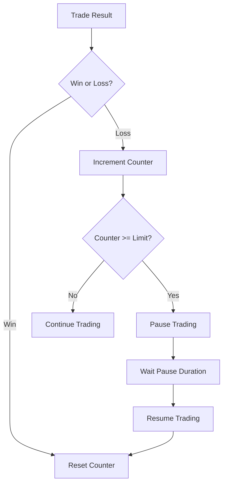
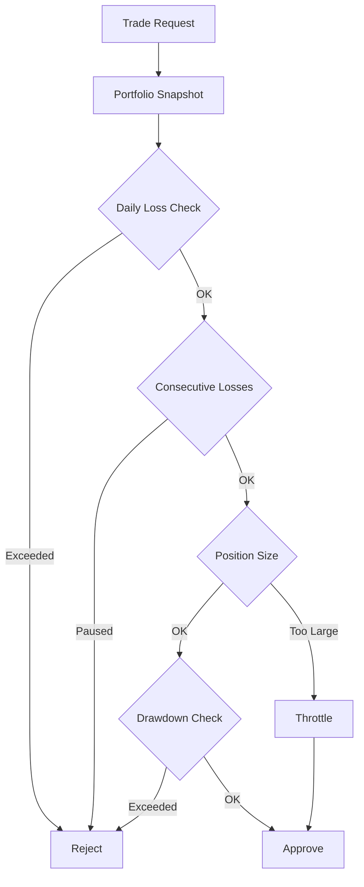

## Overview

NeuraTrade includes comprehensive risk management to protect your capital during autonomous trading. Risk settings control position sizing, loss limits, and emergency safeguards.

<Warning>
  Risk settings are critical for safe autonomous trading. Start with conservative values and adjust based on your risk tolerance.
</Warning>

## Risk Manager Configuration

### Core Risk Parameters

<ParamField path="max_portfolio_risk" type="number" default="0.1">
  Maximum percentage of portfolio at risk (0.0-1.0).
  
  Default: 0.1 (10% max portfolio risk)
  
  ```json
  {
    "max_portfolio_risk": 0.05  // 5% max risk
  }
  ```
</ParamField>

<ParamField path="max_position_risk" type="number" default="0.02">
  Maximum percentage of position at risk per trade (0.0-1.0).
  
  Default: 0.02 (2% max position risk)
  
  ```json
  {
    "max_position_risk": 0.01  // 1% max risk per position
  }
  ```
</ParamField>

<ParamField path="max_daily_loss" type="decimal" default="100.00">
  Maximum allowed daily loss in quote currency (USD).
  
  ```json
  {
    "max_daily_loss": "50.00"
  }
  ```
</ParamField>

<ParamField path="max_drawdown" type="number" default="0.15">
  Maximum allowed drawdown percentage (0.0-1.0).
  
  Default: 0.15 (15% max drawdown)
  
  ```json
  {
    "max_drawdown": 0.10  // 10% max drawdown
  }
  ```
</ParamField>

### Risk:Reward Configuration

<ParamField path="min_risk_reward_ratio" type="number" default="2.0">
  Minimum risk:reward ratio for trade approval.
  
  Default: 2.0 (1:2 minimum ratio)
  
  A ratio of 2.0 means potential profit must be at least 2x the risk.
  
  ```json
  {
    "min_risk_reward_ratio": 3.0  // 1:3 minimum ratio
  }
  ```
</ParamField>

### Position Limits

<ParamField path="max_concurrent_trades" type="number" default="5">
  Maximum number of open positions allowed simultaneously.
  
  ```json
  {
    "max_concurrent_trades": 3
  }
  ```
</ParamField>

<ParamField path="position_size_limit" type="decimal" default="1000.00">
  Maximum position size in quote currency (USD).
  
  ```json
  {
    "position_size_limit": "500.00"
  }
  ```
</ParamField>

### Emergency Thresholds

<ParamField path="emergency_threshold" type="number" default="0.20">
  Drawdown percentage that triggers emergency halt (0.0-1.0).
  
  Default: 0.20 (20% drawdown triggers emergency)
  
  ```json
  {
    "emergency_threshold": 0.15  // Emergency at 15% drawdown
  }
  ```
</ParamField>

<ParamField path="consecutive_loss_limit" type="number" default="3">
  Maximum consecutive losses before automatic trading pause.
  
  ```json
  {
    "consecutive_loss_limit": 2
  }
  ```
</ParamField>

## Daily Loss Tracker

The Daily Loss Tracker monitors cumulative losses within a 24-hour period.

### Configuration

```go
type DailyLossCapConfig struct {
    MaxDailyLoss decimal.Decimal
}
```

### Environment Variable

```bash
# Set via risk manager config
MAX_DAILY_LOSS=100.00
```

### Behavior

- Tracks losses for each user/chat ID
- Resets automatically after 24 hours (TTL)
- Blocks trading when limit exceeded
- Stored in Redis for persistence

### API Usage

```bash
# Check current daily loss
curl http://localhost:58080/api/v1/risk/metrics

# Force resume (admin only)
curl -X POST http://localhost:58080/api/v1/admin/risk/force_resume \
  -H "X-API-Key: your_admin_key"
```

## Consecutive Loss Tracker

Automatically pauses trading after consecutive losses.

### Configuration

<ParamField path="max_consecutive_losses" type="number" default="3">
  Number of consecutive losses that trigger pause.
</ParamField>

<ParamField path="pause_duration" type="duration" default="15m">
  How long trading is paused after consecutive losses.
  
  ```go
  PauseDuration: 30 * time.Minute  // 30 minute pause
  ```
</ParamField>

### Pause Mechanism



### Redis Keys

```
risk:consecutive_loss:{userId}  # Loss counter (24h TTL)
risk:paused:{userId}           # Pause timestamp (15min TTL)
```

## Position Size Throttle

Dynamically reduces position sizes after losses.

### Configuration

<ParamField path="reduction_factor" type="decimal" default="0.7">
  Multiplier applied to position size after each loss.
  
  ```go
  ReductionFactor: decimal.NewFromFloat(0.5)  // 50% reduction
  ```
</ParamField>

<ParamField path="min_position_multiplier" type="decimal" default="0.1">
  Minimum position size multiplier (floor).
  
  Prevents position size from going below 10% of original.
</ParamField>

<ParamField path="loss_threshold" type="number" default="1">
  Number of consecutive losses before throttling starts.
</ParamField>

<ParamField path="recovery_factor" type="decimal" default="1.5">
  Multiplier applied to position size after wins.
  
  ```go
  RecoveryFactor: decimal.NewFromFloat(1.3)  // 30% increase on win
  ```
</ParamField>

### Throttle Calculation

```
After Loss:
newMultiplier = currentMultiplier * reductionFactor^(losses - threshold + 1)

After Win:
newMultiplier = min(currentMultiplier * recoveryFactor, 1.0)

Effective Position Size:
effectiveSize = requestedSize * multiplier
```

### Example

```
Initial position: $1000
Reduction factor: 0.7
Loss threshold: 1

Trade 1: Loss  → Multiplier = 0.7  → Position = $700
Trade 2: Loss  → Multiplier = 0.49 → Position = $490
Trade 3: Win   → Multiplier = 0.74 → Position = $740
Trade 4: Win   → Multiplier = 1.0  → Position = $1000 (recovered)
```

## Drawdown Halt

Automatically halts trading when drawdown exceeds threshold.

### Configuration via Environment

```bash
# Drawdown threshold for recovery-only mode
NEURATRADE_RECOVERY_DERISK_ONLY_DRAWDOWN=0.40  # 40%

# Force manual risk lock
NEURATRADE_QUEST_FORCE_RISK_LOCK=true
```

### Halt Behavior

1. **Monitor**: Continuously track portfolio drawdown
2. **Check**: Compare against `emergency_threshold`
3. **Halt**: Stop all new trades when exceeded
4. **Notify**: Send alert via Telegram
5. **Resume**: Manual override required (admin API)

### Resume Trading

```bash
# Force resume all halted accounts
curl -X POST http://localhost:58080/api/v1/admin/risk/force_resume \
  -H "X-API-Key: your_admin_key"
```

```json Response
{
  "success": true,
  "message": "Trading resumed for all halted accounts",
  "resumed_count": 3,
  "accounts": [
    "chat_123",
    "chat_456",
    "chat_789"
  ]
}
```

## Portfolio Safety Service

Holistic portfolio risk assessment combining all risk components.

### Safety Check Flow



### Safety Response

```json
{
  "trading_allowed": false,
  "reasons": [
    "Daily loss limit exceeded: $125/$100",
    "3 consecutive losses - trading paused for 12m"
  ],
  "risk_metrics": {
    "daily_loss": "125.00",
    "daily_loss_limit": "100.00",
    "consecutive_losses": 3,
    "position_multiplier": "0.49",
    "current_drawdown": 0.08,
    "max_drawdown": 0.15
  }
}
```

## Risk Assessment Levels

<CardGroup cols={4}>
  <Card title="Low" icon="check" color="#10b981">
    Score: 0.0-0.2
    
    Normal trading allowed
  </Card>
  <Card title="Medium" icon="exclamation" color="#f59e0b">
    Score: 0.2-0.5
    
    Warnings issued, monitor closely
  </Card>
  <Card title="High" icon="triangle-exclamation" color="#ef4444">
    Score: 0.5-0.8
    
    Reduce positions, avoid new trades
  </Card>
  <Card title="Extreme" icon="ban" color="#dc2626">
    Score: 0.8-1.0
    
    Emergency halt, close positions
  </Card>
</CardGroup>

## Risk Actions

<Accordion title="Approve">
  Trade is approved with no restrictions.
  
  ```json
  {
    "action": "approve",
    "risk_level": "low",
    "score": 0.15
  }
  ```
</Accordion>

<Accordion title="Warning">
  Trade is approved but with caution flags.
  
  ```json
  {
    "action": "warning",
    "risk_level": "medium",
    "score": 0.35,
    "recommendations": [
      "Monitor position closely",
      "Consider tighter stop-loss"
    ]
  }
  ```
</Accordion>

<Accordion title="Reduce">
  Position size must be reduced.
  
  ```json
  {
    "action": "reduce",
    "risk_level": "high",
    "score": 0.65,
    "max_position_size": "500.00",
    "recommendations": [
      "Reduce position to max $500"
    ]
  }
  ```
</Accordion>

<Accordion title="Block">
  Trade is rejected due to high risk.
  
  ```json
  {
    "action": "block",
    "risk_level": "high",
    "score": 0.75,
    "reasons": [
      "Portfolio risk exceeds maximum threshold"
    ]
  }
  ```
</Accordion>

<Accordion title="Emergency">
  Emergency halt triggered.
  
  ```json
  {
    "action": "emergency",
    "risk_level": "extreme",
    "score": 1.0,
    "reasons": [
      "Drawdown 22% exceeds emergency threshold 20%"
    ],
    "recommendations": [
      "EMERGENCY: All positions should be closed immediately",
      "Halt all trading activity",
      "Review strategy before resuming"
    ]
  }
  ```
</Accordion>

## Configuration Examples

### Conservative (Default)

```go
RiskManagerConfig{
    MaxPortfolioRisk:     0.1,    // 10% max portfolio risk
    MaxPositionRisk:      0.02,   // 2% max per position
    MaxDailyLoss:         decimal.NewFromFloat(100),
    MaxDrawdown:          0.15,   // 15% max drawdown
    MinRiskRewardRatio:   2.0,    // 1:2 minimum
    MaxConcurrentTrades:  5,
    EmergencyThreshold:   0.20,   // 20% emergency halt
    ConsecutiveLossLimit: 3,
    PositionSizeLimit:    decimal.NewFromFloat(1000),
}
```

### Aggressive

```go
RiskManagerConfig{
    MaxPortfolioRisk:     0.2,    // 20% max portfolio risk
    MaxPositionRisk:      0.05,   // 5% max per position
    MaxDailyLoss:         decimal.NewFromFloat(500),
    MaxDrawdown:          0.25,   // 25% max drawdown
    MinRiskRewardRatio:   1.5,    // 1:1.5 minimum
    MaxConcurrentTrades:  10,
    EmergencyThreshold:   0.30,   // 30% emergency halt
    ConsecutiveLossLimit: 5,
    PositionSizeLimit:    decimal.NewFromFloat(5000),
}
```

### Ultra-Conservative

```go
RiskManagerConfig{
    MaxPortfolioRisk:     0.05,   // 5% max portfolio risk
    MaxPositionRisk:      0.01,   // 1% max per position
    MaxDailyLoss:         decimal.NewFromFloat(50),
    MaxDrawdown:          0.10,   // 10% max drawdown
    MinRiskRewardRatio:   3.0,    // 1:3 minimum
    MaxConcurrentTrades:  3,
    EmergencyThreshold:   0.12,   // 12% emergency halt
    ConsecutiveLossLimit: 2,
    PositionSizeLimit:    decimal.NewFromFloat(500),
}
```

## Monitoring Risk Metrics

### Get Risk Metrics

```bash
curl http://localhost:58080/api/v1/risk/metrics
```

```json Response
{
  "total_assessments": 145,
  "approved_trades": 98,
  "blocked_trades": 32,
  "warnings_issued": 15,
  "emergency_triggers": 0,
  "assessments_by_role": {
    "portfolio": 45,
    "position": 67,
    "trading": 33
  },
  "current_metrics": {
    "daily_loss": "45.30",
    "daily_loss_limit": "100.00",
    "consecutive_losses": 1,
    "position_multiplier": "0.7",
    "current_drawdown": 0.05,
    "max_drawdown": 0.15,
    "paused": false
  }
}
```

## Best Practices

1. **Start Conservative**: Use default settings or ultra-conservative config
2. **Paper Trade First**: Test risk settings in paper trading mode
3. **Monitor Daily**: Check risk metrics dashboard daily
4. **Adjust Gradually**: Increase limits slowly based on performance
5. **Set Alerts**: Configure Telegram notifications for risk events
6. **Review Weekly**: Analyze risk assessments and adjust thresholds
7. **Emergency Plan**: Know how to force resume or halt trading
8. **Diversify**: Don't exceed position limits even if allowed

## Troubleshooting

<Accordion title="Trading Blocked by Risk Manager">
  ```bash
  # Check current risk status
  curl http://localhost:58080/api/v1/risk/metrics
  
  # Check specific reasons
  # Look for:
  # - Daily loss exceeded
  # - Consecutive losses
  # - Position size throttle
  # - Drawdown threshold
  
  # Force resume if appropriate (admin only)
  curl -X POST http://localhost:58080/api/v1/admin/risk/force_resume \
    -H "X-API-Key: your_admin_key"
  ```
</Accordion>

<Accordion title="Unexpected Position Size Reduction">
  Check position size throttle status:
  
  ```bash
  # In application logs, look for:
  "Position size reduced by X% due to recent losses"
  
  # Throttle recovers automatically after wins
  # Or reset manually via admin API
  ```
</Accordion>